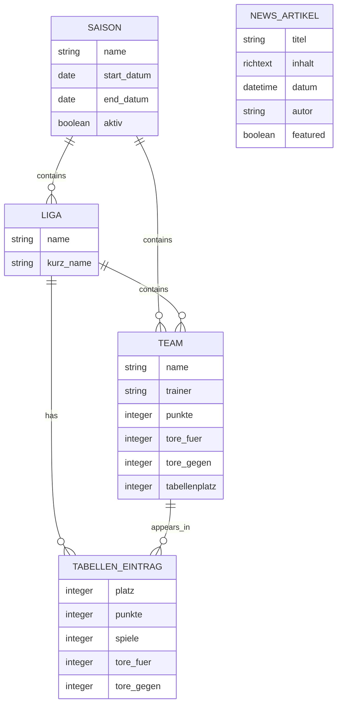
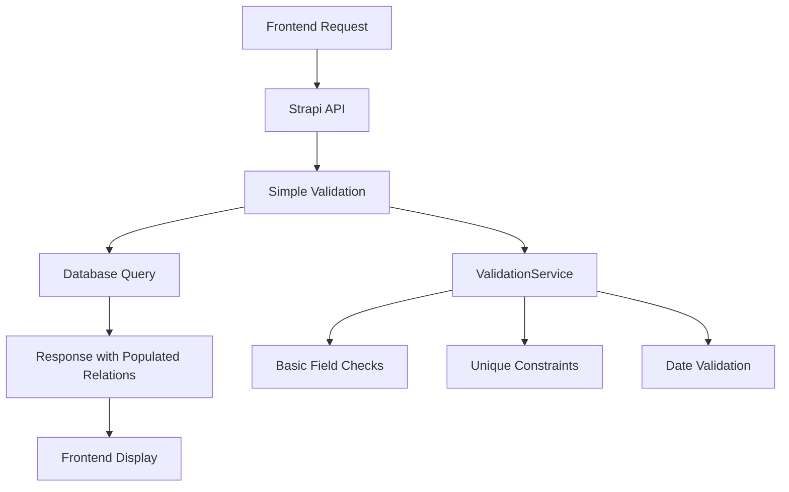

# Design Document

## Overview

Das Backend-Simplification Design folgt dem KISS-Prinzip (Keep It Simple, Stupid) und fokussiert sich auf die Kernfunktionalitäten einer Fußballverein-Website. Ziel ist es, ein wartbares, stabiles System zu schaffen, das ohne komplexe Business Logic auskommt und trotzdem alle notwendigen Features bereitstellt.

## Architecture

### System Architecture
```
Frontend (Next.js) 
    ↓ HTTP/REST
Strapi CMS (Simplified)
    ↓ 
PostgreSQL Database
```

**Prinzipien:**
- Standard Strapi-Funktionalität wo möglich
- Minimale Custom Logic
- Direkte API-Calls ohne komplexe Middleware
- Einfache Datenstrukturen

### Removed Complexity
- User Management Services (komplett entfernt)
- Complex Validation Business Rules
- Auth Controller Extensions  
- Role-based Access Middlewares
- Lifecycle Hooks
- Player/Member Management

## Components and Interfaces

### 1. Simplified Collection Types

#### Team Collection Type (Vereinfacht)
```json
{
  "attributes": {
    "name": "string (required, unique, max: 50)",
    "liga": "relation (manyToOne → Liga)",
    "saison": "relation (manyToOne → Saison)", 
    "trainer": "string (max: 100)",
    "teamfoto": "media (images)",
    "punkte": "integer (min: 0, default: 0)",
    "spiele_gesamt": "integer (min: 0, default: 0)",
    "siege": "integer (min: 0, default: 0)",
    "unentschieden": "integer (min: 0, default: 0)",
    "niederlagen": "integer (min: 0, default: 0)",
    "tore_fuer": "integer (min: 0, default: 0)",
    "tore_gegen": "integer (min: 0, default: 0)",
    "tordifferenz": "integer (default: 0)",
    "tabellenplatz": "integer (min: 1, default: 1)"
  }
}
```

**Entfernte Felder:**
- `status` (aktiv/inaktiv/pausiert) - nicht benötigt
- `trend` (steigend/gleich/fallend) - zu komplex
- `form_letzte_5` (JSON) - zu komplex
- `co_trainer`, `trainingszeiten`, `trainingsort`, `heimspieltag` - optional, können später hinzugefügt werden
- `liga_name`, `liga_vollname` - redundant, über Relation verfügbar
- `altersklasse` - kann später hinzugefügt werden

#### Liga Collection Type (Beibehalten)
```json
{
  "attributes": {
    "name": "string (required, max: 100)",
    "kurz_name": "string (required, max: 50)",
    "saison": "relation (manyToOne → Saison)",
    "teams": "relation (oneToMany ← Team)",
    "tabellen_eintraege": "relation (oneToMany ← Tabellen-Eintrag)"
  }
}
```

**Entfernte Felder:**
- `clubs` (manyToMany) - zu komplex für erste Version
- `spieltage_gesamt` - nicht kritisch

#### Saison Collection Type (Vereinfacht)
```json
{
  "attributes": {
    "name": "string (required, unique, max: 20)",
    "start_datum": "date (required)",
    "end_datum": "date (required)",
    "aktiv": "boolean (default: false, required)",
    "teams": "relation (oneToMany ← Team)",
    "ligas": "relation (oneToMany ← Liga)"
  }
}
```

**Entfernte Felder:**
- `beschreibung` - nicht kritisch

#### News-Artikel Collection Type (Vereinfacht)
```json
{
  "attributes": {
    "titel": "string (required, max: 200)",
    "inhalt": "richtext (required)",
    "datum": "datetime (required)",
    "autor": "string (required, max: 100)",
    "titelbild": "media (images)",
    "featured": "boolean (default: false)",
    "slug": "uid (targetField: titel, required)"
  }
}
```

**Entfernte Felder:**
- `kategorie` - Relation zu komplex für erste Version
- `kurzbeschreibung`, `seo_titel`, `seo_beschreibung`, `lesezeit` - SEO kann später hinzugefügt werden

### 2. Ultra-Simple Validation Service

```typescript
class ValidationService {
  // Basis-Validierungen ohne Business Logic
  static validateRequired(data: any, fields: string[]): string[]
  static validateUnique(contentType: string, field: string, value: any, excludeId?: number): Promise<boolean>
  static validateDateRange(startDate: Date, endDate: Date): string[]
  static validateEnum(value: any, allowedValues: any[]): boolean
}
```

**Funktionen:**
1. **validateRequired**: Prüft ob Pflichtfelder vorhanden sind
2. **validateUnique**: Prüft Eindeutigkeit in der Datenbank
3. **validateDateRange**: Validiert dass Enddatum nach Startdatum liegt
4. **validateEnum**: Prüft ob Wert in erlaubten Enum-Werten enthalten ist

### 3. Simplified Services

#### Team Service (Minimal)
```typescript
export default factories.createCoreService('api::team.team', ({ strapi }) => ({
  async findWithPopulate(params = {}) {
    return await strapi.entityService.findMany('api::team.team', {
      ...params,
      populate: ['liga', 'saison']
    });
  },
  
  async findByLeague(ligaId: number) {
    return await this.findWithPopulate({
      filters: { liga: ligaId },
      sort: { tabellenplatz: 'asc' }
    });
  }
}));
```

**Entfernte Funktionen:**
- `getTeamRoster` - Player-Management entfernt
- `updateTeamStatistics` - Zu komplex
- `validateTeamData` - Business Logic entfernt
- `getTeamDetails` - Zu komplex

## Data Models

### Simplified Entity Relationships



### Data Flow



## Error Handling

### Simplified Error Strategy
1. **Validation Errors**: Return 400 with field-specific messages
2. **Not Found**: Return 404 with simple message
3. **Server Errors**: Return 500 with generic message
4. **No Complex Business Rule Errors**: Keep it simple

### Error Response Format
```json
{
  "error": {
    "status": 400,
    "name": "ValidationError",
    "message": "Validation failed",
    "details": {
      "field": "name",
      "message": "Name is required"
    }
  }
}
```

## Testing Strategy

### Unit Tests (Minimal)
- ValidationService functions
- Basic CRUD operations
- Relation population

### Integration Tests (Essential)
- API endpoints respond correctly
- Database queries work
- Frontend can fetch data

### No Complex Testing
- No Business Logic testing (because there isn't any)
- No User Management testing (removed)
- No Complex Workflow testing

## Performance Considerations

### Database Optimization
- Simple indexes on frequently queried fields
- Basic relation optimization
- No complex query optimization needed

### API Performance  
- Standard Strapi caching
- Basic populate strategies
- No complex aggregation queries

### Frontend Integration
- Direct API calls
- Simple data structures
- Predictable response formats

## Security Considerations

### Simplified Security Model
- Standard Strapi authentication (if needed later)
- Basic input validation
- No complex role-based access control
- Public read access for most content

### Data Protection
- Basic input sanitization
- Standard SQL injection protection (via Strapi ORM)
- No sensitive user data management

## Migration Strategy

### From Current Broken State
1. Remove all broken services and middlewares
2. Reset Collection Types to simplified versions
3. Implement new ValidationService
4. Test basic functionality
5. Update frontend to use simplified API

### Future Extensibility
- Simple base allows easy feature addition
- Standard Strapi patterns for extensions
- Clear separation of concerns
- Documentation for future developers