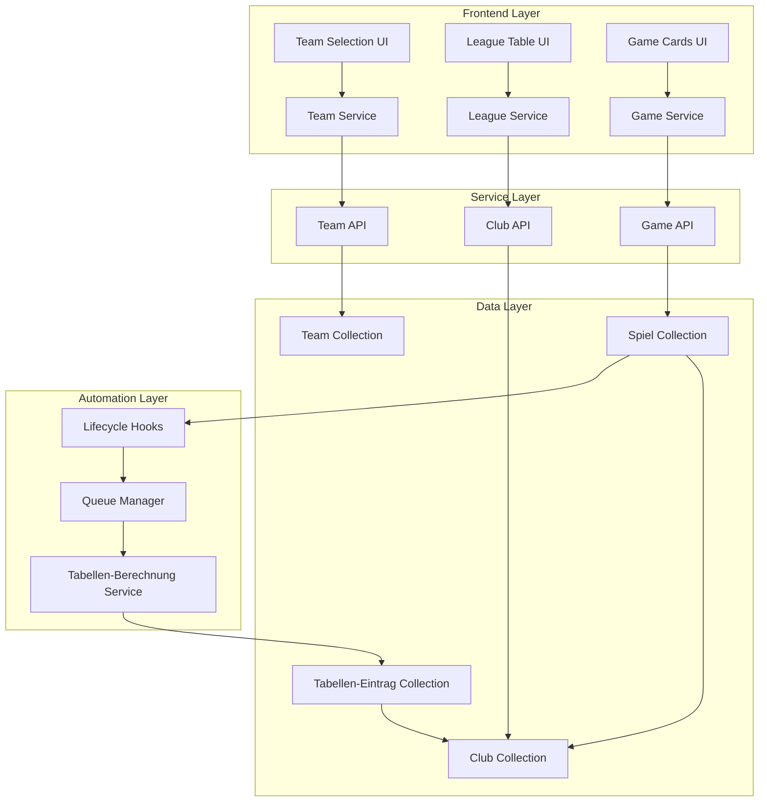
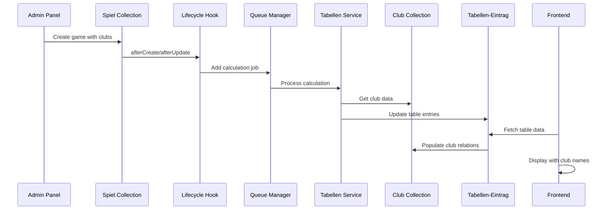

# Design Document

## Overview

Die Club Collection Implementation erweitert das bestehende Viktoria Wertheim System um eine saubere Trennung zwischen internen Teams und Liga-Vereinen. Das Design basiert auf dem Prinzip der parallelen Systeme: Die bestehende Team Collection bleibt für interne Viktoria-Verwaltung bestehen, während eine neue Club Collection echte Vereinsdaten für Liga-Operationen bereitstellt.

## Architecture

### High-Level Architecture



### Data Flow Architecture



## Components and Interfaces

### 1. Club Collection Schema

**Location:** `backend/src/api/club/content-types/club/schema.json`

```typescript
interface ClubSchema {
  name: string;                    // Vollständiger Vereinsname
  kurz_name?: string;             // Abkürzung für Tabellen
  logo?: MediaFile;               // Vereinslogo
  gruendungsjahr?: number;        // Gründungsjahr
  vereinsfarben?: string;         // Vereinsfarben
  heimstadion?: string;           // Heimstadion
  adresse?: string;               // Vereinsadresse
  website?: string;               // Website URL
  club_typ: ClubType;             // viktoria_verein | gegner_verein
  viktoria_team_mapping?: TeamMapping; // team_1 | team_2 | team_3
  ligen: Liga[];                  // Many-to-Many zu Ligen
  aktiv: boolean;                 // Aktiv/Inaktiv Status
}

enum ClubType {
  VIKTORIA_VEREIN = 'viktoria_verein',
  GEGNER_VEREIN = 'gegner_verein'
}

enum TeamMapping {
  TEAM_1 = 'team_1',
  TEAM_2 = 'team_2', 
  TEAM_3 = 'team_3'
}
```

**Responsibilities:**
- Speicherung aller Liga-Vereine
- Zuordnung Viktoria-Vereine zu internen Teams
- Bereitstellung von Vereinsmetadaten
- Liga-Zugehörigkeiten verwalten

### 2. Enhanced Spiel Collection

**Location:** `backend/src/api/spiel/content-types/spiel/schema.json`

```typescript
interface EnhancedSpielSchema {
  // Bestehende Felder
  datum: Date;
  liga: Liga;
  saison: Saison;
  spieltag: number;
  status: SpielStatus;
  heim_tore?: number;
  gast_tore?: number;
  notizen?: string;
  
  // Neue Club-Relationen
  heim_club: Club;               // Neues Hauptfeld
  gast_club: Club;               // Neues Hauptfeld
  
  // Deprecated Team-Relationen (Rückwärtskompatibilität)
  heim_team?: Team;              // DEPRECATED
  gast_team?: Team;              // DEPRECATED
  
  // Automation Felder
  last_calculation?: Date;
  calculation_status?: CalculationStatus;
  calculation_error?: string;
}
```

**Responsibilities:**
- Spiele zwischen echten Vereinen erfassen
- Rückwärtskompatibilität zu Team-System
- Trigger für Tabellen-Automatisierung
- Validierung von Club-Zuordnungen

### 3. Enhanced Tabellen-Eintrag Collection

**Location:** `backend/src/api/tabellen-eintrag/content-types/tabellen-eintrag/schema.json`

```typescript
interface EnhancedTabellenEintragSchema {
  // Bestehende Felder
  team_name: string;             // Echter Vereinsname aus Club
  liga: Liga;
  platz: number;
  spiele: number;
  siege: number;
  unentschieden: number;
  niederlagen: number;
  tore_fuer: number;
  tore_gegen: number;
  tordifferenz: number;
  punkte: number;
  
  // Neue Club-Relation
  club: Club;                    // Neues Hauptfeld
  
  // Deprecated Team-Relation
  team?: Team;                   // DEPRECATED
  
  // Automation Felder
  last_updated: Date;
  auto_calculated: boolean;
  calculation_source: string;
}
```

**Responsibilities:**
- Tabellen-Einträge mit echten Vereinsnamen
- Club-Relationen für Logo und Metadaten
- Automatische Berechnung und Sortierung
- Rückwärtskompatibilität

### 4. Club Service

**Location:** `backend/src/api/club/services/club.js`

```typescript
interface ClubService {
  findClubsByLiga(ligaId: number): Promise<Club[]>;
  findViktoriaClubByTeam(teamMapping: TeamMapping): Promise<Club | null>;
  validateClubInLiga(clubId: number, ligaId: number): Promise<boolean>;
  getClubWithLogo(clubId: number): Promise<Club>;
  createClubIfNotExists(clubData: ClubData): Promise<Club>;
}

interface ClubData {
  name: string;
  kurz_name?: string;
  club_typ: ClubType;
  viktoria_team_mapping?: TeamMapping;
  liga_ids: number[];
}
```

**Responsibilities:**
- CRUD-Operationen für Clubs
- Liga-spezifische Club-Abfragen
- Viktoria-Team-Zuordnungen
- Validierung und Datenintegrität

### 5. Enhanced Tabellen-Berechnungs-Service

**Location:** `backend/src/api/tabellen-eintrag/services/tabellen-berechnung.ts`

```typescript
interface EnhancedTabellenBerechnungsService extends TabellenBerechnungsService {
  // Neue Club-basierte Methoden
  calculateClubStats(clubId: number, ligaId: number, saisonId: number): Promise<TeamStats>;
  getClubsInLiga(ligaId: number, saisonId: number): Promise<Club[]>;
  createMissingClubEntries(ligaId: number, saisonId: number): Promise<void>;
  
  // Erweiterte bestehende Methoden
  calculateTableForLiga(ligaId: number, saisonId: number): Promise<TabellenEintrag[]>;
  
  // Migration Utilities
  migrateTeamToClubEntries(ligaId: number, saisonId: number): Promise<void>;
  validateClubDataIntegrity(ligaId: number, saisonId: number): Promise<ValidationResult>;
}
```

**Responsibilities:**
- Club-basierte Statistik-Berechnung
- Migration von Team- zu Club-System
- Datenintegrität und Validierung
- Performance-Optimierung für Club-Queries

### 6. Enhanced Frontend League Service

**Location:** `frontend/src/services/leagueService.ts`

```typescript
interface EnhancedLeagueService extends LeagueService {
  // Club-Mapping Funktionen
  getClubNameByTeam(teamId: TeamId): string;
  isViktoriaClub(clubName: string, teamId?: TeamId): boolean;
  
  // Erweiterte API-Methoden
  fetchLeagueStandingsByTeam(teamId: TeamId): Promise<Team[]>;
  fetchClubStanding(clubName: string): Promise<Team | null>;
  
  // Cache-Management
  clearClubCache(): void;
  preloadClubData(): Promise<void>;
}

// Neue Mappings
const MANNSCHAFT_CLUB_MAPPING = {
  '1': 'SV Viktoria Wertheim',
  '2': 'SV Viktoria Wertheim II',
  '3': 'SpG Vikt. Wertheim 3/Grünenwort'
} as const;

const VIKTORIA_CLUB_PATTERNS = {
  '1': ['SV Viktoria Wertheim', 'Viktoria Wertheim'],
  '2': ['SV Viktoria Wertheim II', 'Viktoria Wertheim II'],
  '3': ['SpG Vikt. Wertheim 3/Grünenwort', 'Viktoria Wertheim III']
} as const;
```

**Responsibilities:**
- Team-zu-Club Mapping
- Club-basierte API-Aufrufe
- Viktoria-Club-Erkennung
- Cache-Management für Club-Daten

## Data Models

### Club Model

```typescript
interface Club {
  id: number;
  documentId: string;
  name: string;                    // "SV Viktoria Wertheim"
  kurz_name?: string;             // "SV VIK"
  logo?: {
    id: number;
    url: string;
    alternativeText?: string;
  };
  gruendungsjahr?: number;        // 1952
  vereinsfarben?: string;         // "Gelb-Blau"
  heimstadion?: string;           // "Viktoria-Stadion Wertheim"
  adresse?: string;               // "Musterstraße 1, 97877 Wertheim"
  website?: string;               // "https://sv-viktoria-wertheim.de"
  club_typ: 'viktoria_verein' | 'gegner_verein';
  viktoria_team_mapping?: 'team_1' | 'team_2' | 'team_3';
  ligen: Liga[];
  aktiv: boolean;
  createdAt: string;
  updatedAt: string;
}
```

### Enhanced Spiel Model

```typescript
interface EnhancedSpiel {
  id: number;
  documentId: string;
  datum: string;
  liga: Liga;
  saison: Saison;
  spieltag: number;
  status: 'geplant' | 'beendet' | 'abgesagt' | 'verschoben';
  heim_tore?: number;
  gast_tore?: number;
  notizen?: string;
  
  // Neue Club-Relationen
  heim_club: Club;
  gast_club: Club;
  
  // Deprecated (Rückwärtskompatibilität)
  heim_team?: Team;
  gast_team?: Team;
  
  // Automation
  last_calculation?: string;
  calculation_status?: 'pending' | 'processing' | 'completed' | 'failed';
  calculation_error?: string;
  
  createdAt: string;
  updatedAt: string;
}
```

### Enhanced Tabellen-Eintrag Model

```typescript
interface EnhancedTabellenEintrag {
  id: number;
  documentId: string;
  team_name: string;              // Echter Vereinsname aus Club
  liga: Liga;
  club: Club;                     // Neue Club-Relation
  team?: Team;                    // Deprecated
  platz: number;
  spiele: number;
  siege: number;
  unentschieden: number;
  niederlagen: number;
  tore_fuer: number;
  tore_gegen: number;
  tordifferenz: number;
  punkte: number;
  last_updated: string;
  auto_calculated: boolean;
  calculation_source: string;
  createdAt: string;
  updatedAt: string;
}
```

## Migration Strategy

### Phase 1: Schema Extensions

```sql
-- Club Collection (neue Tabelle)
CREATE TABLE clubs (
  id SERIAL PRIMARY KEY,
  document_id VARCHAR(255) UNIQUE,
  name VARCHAR(100) UNIQUE NOT NULL,
  kurz_name VARCHAR(20),
  logo_id INTEGER,
  gruendungsjahr INTEGER,
  vereinsfarben VARCHAR(50),
  heimstadion VARCHAR(100),
  adresse TEXT,
  website VARCHAR(200),
  club_typ VARCHAR(20) DEFAULT 'gegner_verein',
  viktoria_team_mapping VARCHAR(10),
  aktiv BOOLEAN DEFAULT true,
  created_at TIMESTAMP DEFAULT NOW(),
  updated_at TIMESTAMP DEFAULT NOW()
);

-- Spiel Collection erweitern
ALTER TABLE spiele 
ADD COLUMN heim_club_id INTEGER REFERENCES clubs(id),
ADD COLUMN gast_club_id INTEGER REFERENCES clubs(id);

-- Tabellen-Eintrag Collection erweitern  
ALTER TABLE tabellen_eintraege
ADD COLUMN club_id INTEGER REFERENCES clubs(id);

-- Indizes für Performance
CREATE INDEX idx_clubs_liga ON clubs_ligen_links(club_id, liga_id);
CREATE INDEX idx_spiele_clubs ON spiele(heim_club_id, gast_club_id);
CREATE INDEX idx_tabellen_club ON tabellen_eintraege(club_id);
```

### Phase 2: Data Population

```typescript
// Club-Daten für alle Ligen
const clubData = [
  // Viktoria Vereine
  {
    name: "SV Viktoria Wertheim",
    kurz_name: "SV VIK",
    club_typ: "viktoria_verein",
    viktoria_team_mapping: "team_1",
    ligen: ["Kreisliga Tauberbischofsheim"],
    heimstadion: "Viktoria-Stadion Wertheim",
    vereinsfarben: "Gelb-Blau",
    gruendungsjahr: 1952
  },
  {
    name: "SV Viktoria Wertheim II",
    kurz_name: "SV VIK II", 
    club_typ: "viktoria_verein",
    viktoria_team_mapping: "team_2",
    ligen: ["Kreisklasse A Tauberbischofsheim"]
  },
  {
    name: "SpG Vikt. Wertheim 3/Grünenwort",
    kurz_name: "SpG VIK 3",
    club_typ: "viktoria_verein", 
    viktoria_team_mapping: "team_3",
    ligen: ["Kreisklasse B Tauberbischofsheim"]
  },
  
  // Kreisliga Tauberbischofsheim Gegner
  {
    name: "VfR Gerlachsheim",
    kurz_name: "VfR GER",
    club_typ: "gegner_verein",
    ligen: ["Kreisliga Tauberbischofsheim"]
  },
  {
    name: "TSV Jahn Kreuzwertheim", 
    kurz_name: "TSV JAH",
    club_typ: "gegner_verein",
    ligen: ["Kreisliga Tauberbischofsheim"]
  },
  // ... weitere ~13 Vereine
  
  // Kreisklasse A Tauberbischofsheim Gegner
  {
    name: "TSV Unterschüpf",
    kurz_name: "TSV UNT",
    club_typ: "gegner_verein", 
    ligen: ["Kreisklasse A Tauberbischofsheim"]
  },
  // ... weitere ~12 Vereine
  
  // Kreisklasse B Tauberbischofsheim Gegner
  {
    name: "FC Hundheim-Steinbach 2",
    kurz_name: "FC HUN 2",
    club_typ: "gegner_verein",
    ligen: ["Kreisklasse B Tauberbischofsheim"]
  }
  // ... weitere ~10 Vereine
];
```

### Phase 3: Service Migration

```typescript
// Erweiterte Lifecycle Hooks
async afterUpdate(event: LifecycleEvent): Promise<void> {
  const spiel = event.result;
  
  // Unterstützung für beide Systeme
  const hasClubData = spiel.heim_club && spiel.gast_club;
  const hasTeamData = spiel.heim_team && spiel.gast_team;
  
  if (spiel.status === 'beendet' && spiel.heim_tore !== undefined && spiel.gast_tore !== undefined) {
    if (hasClubData) {
      // Neue Club-basierte Verarbeitung
      await this.triggerClubCalculation(spiel);
    } else if (hasTeamData) {
      // Fallback auf Team-basierte Verarbeitung
      await this.triggerTeamCalculation(spiel);
    }
  }
}

// Erweiterte Tabellen-Berechnung
async calculateTableForLiga(ligaId: number, saisonId: number): Promise<TabellenEintrag[]> {
  // Club-basierte Spiele laden
  const clubGames = await this.getClubGamesForLiga(ligaId, saisonId);
  
  // Team-basierte Spiele als Fallback
  const teamGames = await this.getTeamGamesForLiga(ligaId, saisonId);
  
  // Beide Systeme kombinieren
  const allGames = [...clubGames, ...teamGames];
  
  // Unique Clubs/Teams sammeln
  const uniqueEntities = this.collectUniqueEntities(allGames);
  
  // Statistiken berechnen
  const tableEntries = await this.calculateStatsForEntities(uniqueEntities, ligaId, saisonId);
  
  return this.sortTableEntries(tableEntries);
}
```

## Error Handling

### Club-spezifische Fehlertypen

```typescript
enum ClubErrorType {
  CLUB_NOT_FOUND = 'club_not_found',
  CLUB_NOT_IN_LIGA = 'club_not_in_liga', 
  DUPLICATE_CLUB_NAME = 'duplicate_club_name',
  INVALID_VIKTORIA_MAPPING = 'invalid_viktoria_mapping',
  CLUB_INACTIVE = 'club_inactive'
}

interface ClubValidationError {
  type: ClubErrorType;
  message: string;
  clubId?: number;
  clubName?: string;
  ligaId?: number;
  details: any;
}
```

### Validation Rules

```typescript
class ClubValidator {
  validateClubInLiga(club: Club, liga: Liga): ValidationResult {
    if (!club.ligen.some(l => l.id === liga.id)) {
      return {
        isValid: false,
        errors: [{
          type: ClubErrorType.CLUB_NOT_IN_LIGA,
          message: `Club "${club.name}" ist nicht in Liga "${liga.name}" zugeordnet`,
          clubId: club.id,
          ligaId: liga.id
        }]
      };
    }
    return { isValid: true, errors: [] };
  }
  
  validateViktoriaMapping(club: Club): ValidationResult {
    if (club.club_typ === 'viktoria_verein' && !club.viktoria_team_mapping) {
      return {
        isValid: false,
        errors: [{
          type: ClubErrorType.INVALID_VIKTORIA_MAPPING,
          message: `Viktoria-Verein "${club.name}" benötigt Team-Zuordnung`,
          clubId: club.id
        }]
      };
    }
    return { isValid: true, errors: [] };
  }
}
```

## Performance Optimizations

### Database Optimizations

```sql
-- Optimierte Indizes für Club-Queries
CREATE INDEX idx_clubs_typ_aktiv ON clubs(club_typ, aktiv);
CREATE INDEX idx_clubs_viktoria_mapping ON clubs(viktoria_team_mapping) WHERE club_typ = 'viktoria_verein';
CREATE INDEX idx_spiele_clubs_liga_saison ON spiele(heim_club_id, gast_club_id, liga_id, saison_id);
CREATE INDEX idx_tabellen_club_liga ON tabellen_eintraege(club_id, liga_id);

-- Materialized View für häufige Club-Liga Abfragen
CREATE MATERIALIZED VIEW club_liga_stats AS
SELECT 
  c.id as club_id,
  c.name as club_name,
  c.kurz_name,
  l.id as liga_id,
  l.name as liga_name,
  COUNT(s.id) as spiele_count
FROM clubs c
JOIN clubs_ligen_links cll ON c.id = cll.club_id
JOIN ligen l ON cll.liga_id = l.id
LEFT JOIN spiele s ON (s.heim_club_id = c.id OR s.gast_club_id = c.id) AND s.liga_id = l.id
WHERE c.aktiv = true
GROUP BY c.id, c.name, c.kurz_name, l.id, l.name;

-- Refresh-Trigger für Materialized View
CREATE OR REPLACE FUNCTION refresh_club_liga_stats()
RETURNS TRIGGER AS $$
BEGIN
  REFRESH MATERIALIZED VIEW CONCURRENTLY club_liga_stats;
  RETURN NULL;
END;
$$ LANGUAGE plpgsql;

CREATE TRIGGER trigger_refresh_club_stats
  AFTER INSERT OR UPDATE OR DELETE ON spiele
  FOR EACH STATEMENT
  EXECUTE FUNCTION refresh_club_liga_stats();
```

### Caching Strategy

```typescript
// Club-spezifisches Caching
class ClubCacheManager extends CacheManager {
  private clubCache = new Map<string, Club>();
  private ligaClubsCache = new Map<number, Club[]>();
  
  async getClubById(clubId: number): Promise<Club> {
    const cacheKey = `club:${clubId}`;
    
    if (this.clubCache.has(cacheKey)) {
      return this.clubCache.get(cacheKey)!;
    }
    
    const club = await this.strapi.entityService.findOne('api::club.club', clubId, {
      populate: ['logo', 'ligen']
    });
    
    this.clubCache.set(cacheKey, club);
    return club;
  }
  
  async getClubsByLiga(ligaId: number): Promise<Club[]> {
    if (this.ligaClubsCache.has(ligaId)) {
      return this.ligaClubsCache.get(ligaId)!;
    }
    
    const clubs = await this.strapi.entityService.findMany('api::club.club', {
      filters: {
        ligen: { id: ligaId },
        aktiv: true
      },
      populate: ['logo'],
      sort: 'name:asc'
    });
    
    this.ligaClubsCache.set(ligaId, clubs);
    return clubs;
  }
  
  invalidateClubCache(clubId?: number): void {
    if (clubId) {
      this.clubCache.delete(`club:${clubId}`);
    } else {
      this.clubCache.clear();
    }
    this.ligaClubsCache.clear();
  }
}
```

## Testing Strategy

### Unit Tests

```typescript
// Club Service Tests
describe('ClubService', () => {
  test('should find clubs by liga', async () => {
    const clubs = await clubService.findClubsByLiga(1);
    expect(clubs).toHaveLength(16);
    expect(clubs[0]).toHaveProperty('name');
    expect(clubs[0]).toHaveProperty('club_typ');
  });
  
  test('should find viktoria club by team mapping', async () => {
    const club = await clubService.findViktoriaClubByTeam('team_1');
    expect(club?.name).toBe('SV Viktoria Wertheim');
    expect(club?.viktoria_team_mapping).toBe('team_1');
  });
  
  test('should validate club in liga', async () => {
    const isValid = await clubService.validateClubInLiga(1, 1);
    expect(isValid).toBe(true);
  });
});

// Enhanced Tabellen-Berechnung Tests
describe('EnhancedTabellenBerechnungsService', () => {
  test('should calculate club stats correctly', async () => {
    const stats = await service.calculateClubStats(1, 1, 1);
    expect(stats).toHaveProperty('spiele');
    expect(stats).toHaveProperty('punkte');
    expect(stats.punkte).toBe(stats.siege * 3 + stats.unentschieden);
  });
  
  test('should handle mixed team/club games', async () => {
    const table = await service.calculateTableForLiga(1, 1);
    expect(table.length).toBeGreaterThan(0);
    expect(table[0]).toHaveProperty('club');
    expect(table[0].team_name).toBeTruthy();
  });
});
```

### Integration Tests

```typescript
// End-to-End Club Integration
describe('Club Integration', () => {
  test('should create game with clubs and trigger calculation', async () => {
    // Create game with clubs
    const game = await strapi.entityService.create('api::spiel.spiel', {
      data: {
        datum: new Date(),
        liga: 1,
        saison: 1,
        heim_club: 1, // SV Viktoria Wertheim
        gast_club: 2, // VfR Gerlachsheim
        heim_tore: 2,
        gast_tore: 1,
        status: 'beendet',
        spieltag: 1
      }
    });
    
    // Wait for calculation
    await new Promise(resolve => setTimeout(resolve, 1000));
    
    // Check table was updated
    const tableEntries = await strapi.entityService.findMany('api::tabellen-eintrag.tabellen-eintrag', {
      filters: { liga: 1 },
      populate: ['club']
    });
    
    expect(tableEntries.length).toBeGreaterThan(0);
    expect(tableEntries.some(entry => entry.club.name === 'SV Viktoria Wertheim')).toBe(true);
  });
});
```

## Security Considerations

### Access Control

```typescript
// Club-spezifische Permissions
const clubPermissions = {
  'admin': ['create', 'read', 'update', 'delete', 'manage_ligen'],
  'moderator': ['read', 'update', 'create_games'],
  'viewer': ['read']
};

// Validation für Club-Operationen
const validateClubAccess = async (user: User, club: Club, operation: string) => {
  if (operation === 'delete' && club.club_typ === 'viktoria_verein') {
    throw new Error('Viktoria-Vereine können nicht gelöscht werden');
  }
  
  if (operation === 'update' && club.club_typ === 'viktoria_verein' && user.role !== 'admin') {
    throw new Error('Nur Admins können Viktoria-Vereine bearbeiten');
  }
};
```

### Data Validation

```typescript
// Input Sanitization für Club-Daten
const sanitizeClubInput = (input: any): ClubData => {
  return {
    name: sanitizeString(input.name, 100),
    kurz_name: input.kurz_name ? sanitizeString(input.kurz_name, 20) : undefined,
    club_typ: ['viktoria_verein', 'gegner_verein'].includes(input.club_typ) ? input.club_typ : 'gegner_verein',
    viktoria_team_mapping: input.viktoria_team_mapping && ['team_1', 'team_2', 'team_3'].includes(input.viktoria_team_mapping) 
      ? input.viktoria_team_mapping 
      : undefined,
    gruendungsjahr: input.gruendungsjahr && input.gruendungsjahr >= 1800 && input.gruendungsjahr <= 2030 
      ? input.gruendungsjahr 
      : undefined,
    aktiv: Boolean(input.aktiv)
  };
};
```

## Deployment Strategy

### Feature Flags

```typescript
// Feature Toggles für schrittweise Einführung
const clubFeatures = {
  enableClubCollection: process.env.ENABLE_CLUB_COLLECTION === 'true',
  enableClubGames: process.env.ENABLE_CLUB_GAMES === 'true', 
  enableClubTables: process.env.ENABLE_CLUB_TABLES === 'true',
  enableClubMigration: process.env.ENABLE_CLUB_MIGRATION === 'true'
};

// Graduelle Aktivierung
if (clubFeatures.enableClubCollection) {
  // Club Collection verfügbar machen
}

if (clubFeatures.enableClubGames) {
  // Club-basierte Spiele aktivieren
}

if (clubFeatures.enableClubTables) {
  // Club-basierte Tabellen aktivieren
}
```

### Rollback Plan

```typescript
// Emergency Rollback für Club-System
const emergencyClubRollback = async () => {
  console.log('Starting emergency club rollback...');
  
  // 1. Disable club features
  await setFeatureFlag('enableClubCollection', false);
  await setFeatureFlag('enableClubGames', false);
  await setFeatureFlag('enableClubTables', false);
  
  // 2. Clear club-related caches
  await clubCacheManager.clearAll();
  
  // 3. Revert to team-based calculations
  await queueManager.clearQueue();
  await triggerTeamBasedRecalculation();
  
  // 4. Notify administrators
  await notificationService.sendEmergencyAlert('Club system rollback completed - reverted to team-based system');
  
  console.log('Emergency club rollback completed');
};
```

## Monitoring and Observability

### Club-spezifische Metriken

```typescript
// Metriken für Club-System
const clubMetrics = {
  clubCreationRate: 'counter',
  clubGameProcessingTime: 'histogram',
  clubTableCalculationDuration: 'histogram',
  clubCacheHitRate: 'gauge',
  clubValidationErrors: 'counter',
  clubMigrationProgress: 'gauge'
};

// Health Checks
const clubHealthChecks = {
  clubDatabase: () => checkClubTableIntegrity(),
  clubCache: () => checkClubCacheHealth(),
  clubMigration: () => checkMigrationStatus(),
  clubValidation: () => validateAllClubData()
};
```

### Logging Strategy

```typescript
// Strukturiertes Logging für Club-Operationen
const clubLogger = {
  clubCreated: (club: Club) => log('info', 'Club created', { 
    clubId: club.id, 
    clubName: club.name, 
    clubType: club.club_typ 
  }),
  
  clubGameProcessed: (game: Spiel) => log('info', 'Club game processed', {
    gameId: game.id,
    heimClub: game.heim_club.name,
    gastClub: game.gast_club.name,
    result: `${game.heim_tore}:${game.gast_tore}`
  }),
  
  clubTableCalculated: (ligaId: number, duration: number, clubCount: number) => log('info', 'Club table calculated', {
    ligaId,
    duration,
    clubCount,
    performance: duration < 5000 ? 'good' : 'slow'
  })
};
```