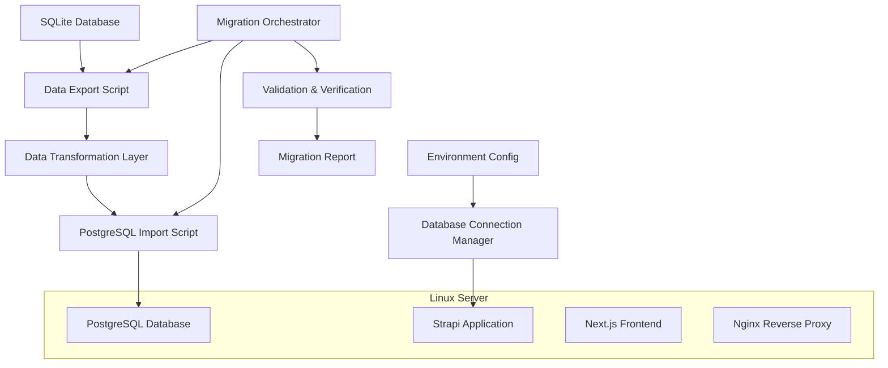
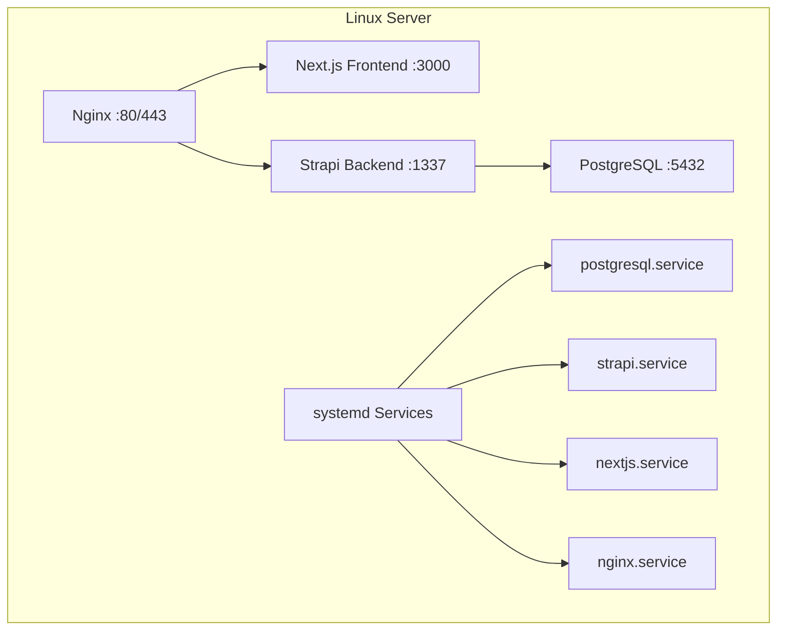

# Design Document

## Overview

This design document outlines the technical approach for migrating the Viktoria Wertheim Strapi backend from SQLite to PostgreSQL for self-hosted deployment on a single Linux server. The migration will be implemented as a comprehensive solution that includes database configuration updates, data migration scripts, environment management, and single-server deployment considerations.

The migration strategy focuses on optimal resource utilization for a single-server setup, data integrity preservation, and maintaining development workflow compatibility. The solution will support local development flexibility while optimizing PostgreSQL for co-location with Strapi backend and Next.js frontend on the same Linux server.

## Architecture

### Current State
- **Database**: SQLite with file-based storage (`.tmp/data.db`)
- **ORM**: Strapi's built-in database layer with Knex.js
- **Configuration**: Environment-based database client selection
- **Content Types**: 9 main content types (sponsors, news, teams, players, etc.)
- **Dependencies**: `better-sqlite3` package for SQLite connectivity
- **Frontend Data**: Mix of API data and mock data fallbacks in components (needs cleanup)

### Target State
- **Database**: PostgreSQL with optimized connection pooling for single-server deployment
- **ORM**: Same Strapi database layer, different adapter
- **Configuration**: Enhanced environment-based configuration with PostgreSQL-specific settings optimized for local connections
- **Content Types**: Identical schema, migrated data
- **Dependencies**: `pg` package for PostgreSQL connectivity
- **Server Setup**: PostgreSQL, Strapi backend, and Next.js frontend co-located on single Linux server

### Migration Architecture



### Single-Server Architecture



## Components and Interfaces

### 1. Database Configuration Manager
**Purpose**: Handle environment-specific database connections and configuration

**Interface**:
```typescript
interface DatabaseConfig {
  client: 'sqlite' | 'postgres';
  connection: SQLiteConnection | PostgreSQLConnection;
  pool?: PoolConfig;
  migrations?: MigrationConfig;
}

interface PostgreSQLConnection {
  host: string;
  port: number;
  database: string;
  user: string;
  password: string;
  ssl?: SSLConfig;
  schema?: string;
  connectionString?: string;
}
```

**Responsibilities**:
- Parse environment variables for database configuration
- Validate connection parameters
- Provide fallback mechanisms for development environments
- Optimize connection settings for local PostgreSQL instance
- Handle Unix domain socket connections when available
- Configure connection pooling for single-server resource sharing

### 2. Data Migration Engine
**Purpose**: Extract data from SQLite and import into PostgreSQL

**Interface**:
```typescript
interface MigrationEngine {
  exportData(): Promise<ExportResult>;
  transformData(data: ExportResult): Promise<TransformResult>;
  importData(data: TransformResult): Promise<ImportResult>;
  validateMigration(): Promise<ValidationResult>;
}

interface MigrationResult {
  success: boolean;
  recordsProcessed: number;
  errors: MigrationError[];
  duration: number;
  timestamp: Date;
}
```

**Responsibilities**:
- Extract all content types and system data from SQLite
- Handle data type conversions between SQLite and PostgreSQL
- Preserve relationships and foreign key constraints
- Maintain data integrity during transfer
- Provide detailed logging and error reporting

### 3. Schema Synchronization Service
**Purpose**: Ensure PostgreSQL schema matches Strapi content type definitions

**Interface**:
```typescript
interface SchemaSyncService {
  generateSchema(): Promise<SchemaDefinition>;
  applyMigrations(): Promise<MigrationResult>;
  validateSchema(): Promise<ValidationResult>;
}
```

**Responsibilities**:
- Generate PostgreSQL schema from Strapi content types
- Apply database migrations in correct order
- Handle index creation and optimization
- Validate schema consistency

### 4. Frontend Mock Data Cleanup Service
**Purpose**: Remove all mock data from frontend components before migration

**Interface**:
```typescript
interface MockDataCleanupService {
  identifyMockDataUsage(): Promise<MockDataReport>;
  removeMockDataFallbacks(): Promise<CleanupResult>;
  validateCleanup(): Promise<ValidationResult>;
}

interface MockDataReport {
  componentsWithMockData: string[];
  mockDataTypes: string[];
  fallbackPatterns: string[];
}
```

**Responsibilities**:
- Identify all frontend components using mock data fallbacks
- Remove mock data constants and fallback logic
- Replace with proper loading states and empty data handling
- Ensure only real API data or appropriate empty states are displayed
- Validate that no mock data remains in the codebase

### 5. Backup and Recovery Manager
**Purpose**: Create backups and provide rollback capabilities

**Interface**:
```typescript
interface BackupManager {
  createBackup(): Promise<BackupResult>;
  restoreBackup(backupId: string): Promise<RestoreResult>;
  validateBackup(backupId: string): Promise<ValidationResult>;
}
```

**Responsibilities**:
- Create SQLite database backups before migration
- Generate PostgreSQL dumps after successful migration
- Provide rollback mechanisms
- Verify backup integrity

## Data Models

### Content Type Mapping
The migration will preserve all existing Strapi content types:

1. **Sponsors** (`sponsors`)
   - Fields: name, logo, website_url, beschreibung, kategorie, reihenfolge, aktiv
   - Special considerations: Media field handling, enumeration values

2. **News Articles** (`news_artikels`)
   - Rich text content, media relations, publication dates

3. **Teams** (`mannschafts`)
   - Team hierarchies, player relationships

4. **Players** (`spielers`)
   - Personal data, team associations, statistics

5. **Matches** (`spiels`)
   - Date/time handling, team relationships, results

6. **Training** (`trainings`)
   - Schedule data, location information

7. **Members** (`mitglieds`)
   - User data, membership information

8. **Categories** (`kategorien`)
   - Classification system for content organization

9. **Leaderboard Entries** (`leaderboard_entries`)
   - Statistical data, rankings

### Data Type Conversions

| SQLite Type | PostgreSQL Type | Notes |
|-------------|-----------------|-------|
| INTEGER | SERIAL/INTEGER | Auto-increment handling |
| TEXT | VARCHAR/TEXT | Length constraints preserved |
| REAL | DECIMAL/NUMERIC | Precision considerations |
| BLOB | BYTEA | Binary data for media |
| DATETIME | TIMESTAMP | Timezone handling |
| BOOLEAN | BOOLEAN | Direct mapping |

## Error Handling

### Migration Error Categories
1. **Connection Errors**: Database connectivity issues
2. **Schema Errors**: Structure mismatch or constraint violations
3. **Data Errors**: Content validation or transformation failures
4. **Performance Errors**: Timeout or resource exhaustion

### Error Recovery Strategies
- **Retry Logic**: Automatic retry for transient connection issues
- **Partial Recovery**: Continue migration after resolving specific errors
- **Rollback Capability**: Restore to pre-migration state
- **Manual Intervention**: Detailed error reporting for manual fixes

### Logging and Monitoring
- Structured logging with migration progress tracking
- Performance metrics collection
- Error categorization and reporting
- Migration audit trail

## Testing Strategy

### Unit Testing
- Database configuration parsing and validation
- Data transformation logic
- Schema generation and validation
- Backup and restore functionality

### Integration Testing
- End-to-end migration workflow
- Database connection handling across environments
- Strapi application startup with PostgreSQL
- Content type functionality verification

### Performance Testing
- Large dataset migration performance
- Concurrent connection handling
- Query performance comparison (SQLite vs PostgreSQL)
- Memory usage during migration

### Acceptance Testing
- Complete application functionality after migration
- Data integrity verification
- User authentication and permissions
- Content management operations
- API endpoint functionality

### Test Data Strategy
- Use existing development data for migration testing
- Create synthetic datasets for performance testing
- Test edge cases with malformed or incomplete data
- Validate migration with production-like data volumes

## Deployment Considerations

### Single-Server Linux Deployment

#### System Requirements
- **Operating System**: Ubuntu 20.04+ or similar Linux distribution
- **Memory**: Minimum 2GB RAM (4GB recommended for optimal performance)
- **Storage**: SSD recommended for database performance
- **Services**: systemd for service management

#### Service Configuration
- **PostgreSQL**: Local installation with optimized settings for single-server
- **Strapi Backend**: systemd service with automatic restart
- **Next.js Frontend**: Production build served by systemd service
- **Nginx**: Reverse proxy for frontend and API routing

### Environment Configuration
- **Development**: Optional PostgreSQL, SQLite fallback
- **Staging**: PostgreSQL required, migration testing
- **Production**: PostgreSQL only, optimized for single-server deployment

### Performance Optimization for Single-Server
- **Connection Pooling**: Optimized for local connections (max 10-15 connections)
- **Memory Allocation**: PostgreSQL configured to use ~25% of available RAM
- **Index Optimization**: PostgreSQL indexes optimized for content queries
- **Unix Domain Sockets**: Use local socket connections when possible
- **Resource Sharing**: Balanced resource allocation between PostgreSQL, Strapi, and Next.js

### Security Considerations for Self-Hosted Setup
- **Local Connections**: PostgreSQL configured for local-only access
- **Firewall**: Only HTTP/HTTPS ports exposed externally
- **Database Access**: No external database connections allowed
- **File Permissions**: Proper Linux file permissions for database files
- **Backup Security**: Local backups with restricted file access
- **Service Isolation**: Each service runs with minimal required permissions

### Linux Server Setup Requirements
- **PostgreSQL Installation**: System package installation and configuration
- **Service Dependencies**: Proper systemd service ordering (PostgreSQL → Strapi → Next.js)
- **Log Management**: Centralized logging with logrotate
- **Backup Strategy**: Local pg_dump backups with retention policy
- **Process Management**: systemd service files for all components

### Monitoring and Maintenance for Self-Hosted
- **System Monitoring**: Basic server resource monitoring
- **Database Health**: PostgreSQL connection and performance monitoring
- **Service Status**: systemd service health checks
- **Log Monitoring**: Application and database log analysis
- **Backup Verification**: Automated backup integrity checks
- **Update Strategy**: Coordinated updates of all components