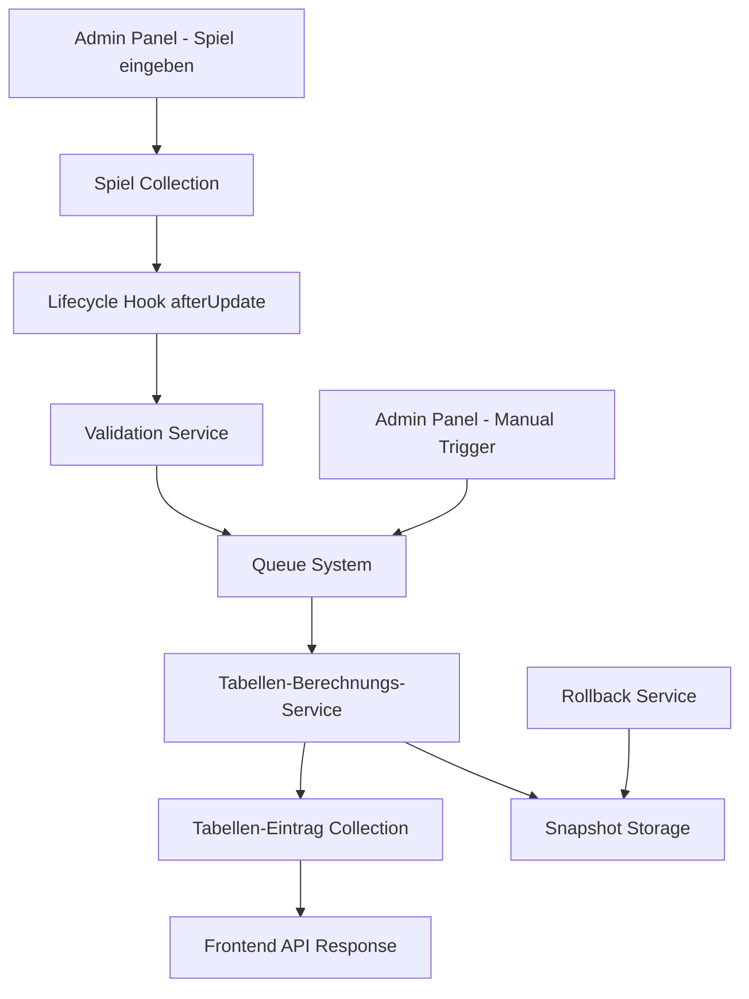
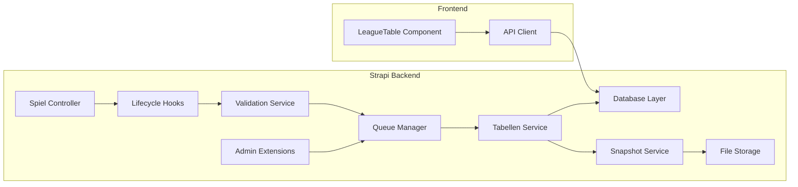

# Design Document

## Overview

Die Tabellen-Automatisierung wird als Event-driven System implementiert, das auf Änderungen in der `spiel` Collection reagiert und automatisch die entsprechenden `tabellen-eintrag` Datensätze aktualisiert. Das System nutzt Strapi's Lifecycle Hooks, einen dedizierten Berechnungsservice und eine Queue für die Verarbeitung.

## Architecture

### High-Level Architecture



### Component Architecture



## Components and Interfaces

### 1. Lifecycle Hook System

**Location:** `backend/src/api/spiel/lifecycles.js`

```javascript
interface SpielLifecycle {
  afterCreate(event: LifecycleEvent): Promise<void>
  afterUpdate(event: LifecycleEvent): Promise<void>
  afterDelete(event: LifecycleEvent): Promise<void>
}

interface LifecycleEvent {
  result: SpielEntity
  params: QueryParams
}
```

**Responsibilities:**
- Erkennung von relevanten Änderungen (Tore, Status)
- Triggering der Tabellenberechnung
- Fehlerbehandlung und Logging

### 2. Validation Service

**Location:** `backend/src/api/spiel/services/validation.js`

```javascript
interface ValidationService {
  validateSpielResult(spiel: SpielEntity): ValidationResult
  validateTeamConsistency(heimTeam: Team, gastTeam: Team): ValidationResult
  validateScores(heimTore: number, gastTore: number): ValidationResult
}

interface ValidationResult {
  isValid: boolean
  errors: ValidationError[]
}

interface ValidationError {
  field: string
  message: string
  code: string
}
```

**Responsibilities:**
- Validierung von Spielergebnissen
- Konsistenzprüfungen
- Fehlersammlung und -formatierung

### 3. Queue Manager

**Location:** `backend/src/api/tabellen-eintrag/services/queue-manager.js`

```javascript
interface QueueManager {
  addCalculationJob(ligaId: number, saisonId: number, priority?: Priority): Promise<JobId>
  processQueue(): Promise<void>
  getQueueStatus(): QueueStatus
  pauseQueue(): void
  resumeQueue(): void
}

interface CalculationJob {
  id: JobId
  ligaId: number
  saisonId: number
  priority: Priority
  status: JobStatus
  createdAt: Date
  startedAt?: Date
  completedAt?: Date
  error?: string
}

enum Priority {
  LOW = 1,
  NORMAL = 2,
  HIGH = 3,
  CRITICAL = 4
}

enum JobStatus {
  PENDING = 'pending',
  PROCESSING = 'processing',
  COMPLETED = 'completed',
  FAILED = 'failed'
}
```

**Responsibilities:**
- Job-Queue Management
- Prioritätsverwaltung
- Parallelverarbeitung
- Retry-Logic

### 4. Tabellen-Berechnungs-Service

**Location:** `backend/src/api/tabellen-eintrag/services/tabellen-berechnung.js`

```javascript
interface TabellenBerechnungsService {
  calculateTableForLiga(ligaId: number, saisonId: number): Promise<TabellenEintrag[]>
  calculateTeamStats(teamId: number, ligaId: number, saisonId: number): Promise<TeamStats>
  sortTableEntries(entries: TabellenEintrag[]): TabellenEintrag[]
  createMissingEntries(ligaId: number, saisonId: number): Promise<void>
}

interface TeamStats {
  spiele: number
  siege: number
  unentschieden: number
  niederlagen: number
  toreFuer: number
  toreGegen: number
  tordifferenz: number
  punkte: number
}

interface TabellenEintrag {
  id: number
  teamName: string
  team: Team
  liga: Liga
  platz: number
  spiele: number
  siege: number
  unentschieden: number
  niederlagen: number
  toreFuer: number
  toreGegen: number
  tordifferenz: number
  punkte: number
}
```

**Responsibilities:**
- Berechnung der Teamstatistiken
- Sortierung nach Fußballregeln
- Aktualisierung der Tabelleneinträge
- Transaktionsmanagement

### 5. Snapshot Service

**Location:** `backend/src/api/tabellen-eintrag/services/snapshot.js`

```javascript
interface SnapshotService {
  createSnapshot(ligaId: number, saisonId: number): Promise<SnapshotId>
  restoreSnapshot(snapshotId: SnapshotId): Promise<void>
  listSnapshots(ligaId: number, saisonId: number): Promise<Snapshot[]>
  deleteOldSnapshots(maxAge: number): Promise<void>
}

interface Snapshot {
  id: SnapshotId
  ligaId: number
  saisonId: number
  data: TabellenEintrag[]
  createdAt: Date
  description: string
}
```

**Responsibilities:**
- Snapshot-Erstellung vor Berechnungen
- Rollback-Funktionalität
- Snapshot-Verwaltung und Cleanup

### 6. Admin Panel Extensions

**Location:** `backend/src/admin/extensions/tabellen-automatisierung/`

```javascript
interface AdminExtension {
  addRecalculateButton(): void
  addQueueMonitoring(): void
  addSnapshotManagement(): void
  showCalculationStatus(): void
}

interface AdminAPI {
  triggerRecalculation(ligaId: number): Promise<JobId>
  getQueueStatus(): Promise<QueueStatus>
  pauseAutomation(): Promise<void>
  resumeAutomation(): Promise<void>
  rollbackToSnapshot(snapshotId: SnapshotId): Promise<void>
}
```

**Responsibilities:**
- UI-Erweiterungen für Administratoren
- Manuelle Trigger-Funktionen
- Monitoring und Status-Anzeige

## Data Models

### Enhanced Spiel Model

```javascript
// Existing fields remain unchanged
{
  datum: "datetime",
  liga: "relation to liga",
  saison: "relation to saison", 
  heim_team: "relation to team",
  gast_team: "relation to team",
  heim_tore: "integer",
  gast_tore: "integer",
  spieltag: "integer",
  status: "enum[geplant, beendet, abgesagt, verschoben]",
  notizen: "text",
  
  // New fields for automation
  last_calculation: "datetime",
  calculation_status: "enum[pending, processing, completed, failed]",
  calculation_error: "text"
}
```

### Enhanced Tabellen-Eintrag Model

```javascript
// Existing fields remain unchanged
{
  team_name: "string",
  liga: "relation to liga",
  team: "relation to team",
  team_logo: "media",
  platz: "integer",
  spiele: "integer",
  siege: "integer", 
  unentschieden: "integer",
  niederlagen: "integer",
  tore_fuer: "integer",
  tore_gegen: "integer",
  tordifferenz: "integer",
  punkte: "integer",
  
  // New fields for automation
  last_updated: "datetime",
  auto_calculated: "boolean",
  calculation_source: "string"
}
```

### New Queue Job Model

```javascript
{
  id: "integer",
  liga_id: "integer",
  saison_id: "integer", 
  priority: "integer",
  status: "enum[pending, processing, completed, failed]",
  created_at: "datetime",
  started_at: "datetime",
  completed_at: "datetime",
  error_message: "text",
  retry_count: "integer",
  max_retries: "integer"
}
```

### New Snapshot Model

```javascript
{
  id: "integer",
  liga_id: "integer",
  saison_id: "integer",
  snapshot_data: "json",
  created_at: "datetime",
  description: "string",
  created_by: "relation to admin-user",
  file_path: "string"
}
```

## Error Handling

### Error Types

```javascript
enum CalculationErrorType {
  VALIDATION_ERROR = 'validation_error',
  DATABASE_ERROR = 'database_error', 
  TIMEOUT_ERROR = 'timeout_error',
  CONCURRENCY_ERROR = 'concurrency_error',
  SYSTEM_ERROR = 'system_error'
}

interface CalculationError {
  type: CalculationErrorType
  message: string
  details: any
  timestamp: Date
  ligaId: number
  saisonId: number
  retryable: boolean
}
```

### Error Handling Strategy

1. **Validation Errors:** Sofortige Rückgabe an Admin mit Details
2. **Database Errors:** Retry mit exponential backoff (max 3x)
3. **Timeout Errors:** Job neu in Queue einreihen
4. **Concurrency Errors:** Kurze Wartezeit, dann Retry
5. **System Errors:** Logging, Admin-Benachrichtigung, manuelle Intervention

### Fallback Mechanisms

```javascript
interface FallbackStrategy {
  onCalculationFailure(): Promise<void>
  onQueueOverload(): Promise<void>
  onDatabaseUnavailable(): Promise<void>
}
```

1. **Calculation Failure:** Rollback zu letztem Snapshot
2. **Queue Overload:** Pausierung neuer Jobs, Priorisierung kritischer Jobs
3. **Database Unavailable:** Graceful degradation, Read-only Modus

## Testing Strategy

### Unit Tests

```javascript
// Tabellen-Berechnungs-Service Tests
describe('TabellenBerechnungsService', () => {
  test('calculateTeamStats - should calculate correct points for win')
  test('calculateTeamStats - should calculate correct points for draw')
  test('calculateTeamStats - should calculate correct goal difference')
  test('sortTableEntries - should sort by points first')
  test('sortTableEntries - should sort by goal difference second')
  test('sortTableEntries - should sort by goals scored third')
})

// Validation Service Tests  
describe('ValidationService', () => {
  test('validateSpielResult - should reject negative scores')
  test('validateSpielResult - should reject team playing against itself')
  test('validateSpielResult - should require both scores for completed game')
})

// Queue Manager Tests
describe('QueueManager', () => {
  test('addCalculationJob - should add job with correct priority')
  test('processQueue - should process jobs in priority order')
  test('processQueue - should handle concurrent jobs correctly')
})
```

### Integration Tests

```javascript
// End-to-End Automation Tests
describe('Tabellen Automation Integration', () => {
  test('should automatically update table when game result is entered')
  test('should handle multiple simultaneous game updates')
  test('should maintain data consistency during concurrent updates')
  test('should recover from database connection failures')
})

// Admin Panel Integration Tests
describe('Admin Panel Extensions', () => {
  test('manual recalculation button should trigger calculation')
  test('queue status should update in real-time')
  test('rollback should restore previous table state')
})
```

### Performance Tests

```javascript
// Load Testing
describe('Performance Tests', () => {
  test('should calculate table for 16 teams in under 5 seconds')
  test('should handle 100 concurrent game updates')
  test('should process queue of 50 jobs within 2 minutes')
  test('should maintain response time under load')
})
```

## Security Considerations

### Access Control

```javascript
// Admin-only endpoints
const adminRoutes = [
  'POST /api/tabellen-eintraege/recalculate',
  'GET /api/tabellen-eintraege/queue-status', 
  'POST /api/tabellen-eintraege/pause-automation',
  'POST /api/tabellen-eintraege/rollback'
]

// Role-based permissions
const permissions = {
  'admin': ['read', 'write', 'calculate', 'rollback'],
  'moderator': ['read', 'write'],
  'viewer': ['read']
}
```

### Data Validation

```javascript
// Input sanitization
const sanitizeSpielInput = (input) => {
  return {
    heim_tore: Math.max(0, parseInt(input.heim_tore) || 0),
    gast_tore: Math.max(0, parseInt(input.gast_tore) || 0),
    status: ['geplant', 'beendet', 'abgesagt', 'verschoben'].includes(input.status) 
      ? input.status 
      : 'geplant'
  }
}
```

### Audit Logging

```javascript
interface AuditLog {
  action: string
  userId: number
  entityType: string
  entityId: number
  oldValues: any
  newValues: any
  timestamp: Date
  ipAddress: string
}
```

## Performance Optimizations

### Database Optimizations

```sql
-- Indexes for faster queries
CREATE INDEX idx_spiele_liga_saison_status ON spiele(liga_id, saison_id, status);
CREATE INDEX idx_tabellen_liga_saison ON tabellen_eintraege(liga_id, saison_id);
CREATE INDEX idx_spiele_teams ON spiele(heim_team_id, gast_team_id);

-- Materialized view for complex calculations
CREATE MATERIALIZED VIEW team_statistics AS
SELECT 
  team_id,
  liga_id,
  saison_id,
  COUNT(*) as spiele,
  SUM(CASE WHEN (heim_team_id = team_id AND heim_tore > gast_tore) 
           OR (gast_team_id = team_id AND gast_tore > heim_tore) 
           THEN 1 ELSE 0 END) as siege,
  -- ... weitere Berechnungen
FROM spiele_calculated
GROUP BY team_id, liga_id, saison_id;
```

### Caching Strategy

```javascript
// Redis caching for frequently accessed data
const cacheConfig = {
  tableData: { ttl: 300 }, // 5 minutes
  teamStats: { ttl: 600 }, // 10 minutes
  queueStatus: { ttl: 30 } // 30 seconds
}

// Cache invalidation on updates
const invalidateCache = async (ligaId, saisonId) => {
  await redis.del(`table:${ligaId}:${saisonId}`)
  await redis.del(`teams:${ligaId}:${saisonId}:*`)
}
```

### Background Processing

```javascript
// Queue configuration
const queueConfig = {
  concurrency: 3, // Max 3 parallel calculations
  attempts: 3,    // Max 3 retry attempts
  backoff: {
    type: 'exponential',
    delay: 2000
  },
  removeOnComplete: 10, // Keep last 10 completed jobs
  removeOnFail: 50      // Keep last 50 failed jobs
}
```

## Monitoring and Observability

### Metrics Collection

```javascript
// Key metrics to track
const metrics = {
  calculationDuration: 'histogram',
  calculationErrors: 'counter',
  queueLength: 'gauge',
  activeJobs: 'gauge',
  apiResponseTime: 'histogram'
}

// Health checks
const healthChecks = {
  database: () => checkDatabaseConnection(),
  queue: () => checkQueueHealth(),
  calculations: () => checkRecentCalculations()
}
```

### Logging Strategy

```javascript
// Structured logging
const logger = {
  info: (message, context) => log('info', message, context),
  warn: (message, context) => log('warn', message, context),
  error: (message, error, context) => log('error', message, { error, ...context })
}

// Log contexts
const logContexts = {
  calculation: { ligaId, saisonId, duration, teamsProcessed },
  queue: { jobId, priority, status, retryCount },
  api: { endpoint, method, responseTime, statusCode }
}
```

## Deployment Strategy

### Feature Flags

```javascript
// Feature toggles for gradual rollout
const features = {
  automaticCalculation: process.env.ENABLE_AUTO_CALCULATION === 'true',
  queueProcessing: process.env.ENABLE_QUEUE === 'true',
  adminExtensions: process.env.ENABLE_ADMIN_EXT === 'true'
}
```

### Migration Plan

1. **Phase 1:** Deploy services without activation
2. **Phase 2:** Enable for single test league
3. **Phase 3:** Gradual rollout to all leagues
4. **Phase 4:** Remove manual fallback options

### Rollback Plan

```javascript
// Emergency rollback procedure
const emergencyRollback = async () => {
  // 1. Disable automation
  await setFeatureFlag('automaticCalculation', false)
  
  // 2. Clear queue
  await queueManager.clearQueue()
  
  // 3. Restore from latest snapshots
  const snapshots = await snapshotService.getLatestSnapshots()
  for (const snapshot of snapshots) {
    await snapshotService.restoreSnapshot(snapshot.id)
  }
  
  // 4. Notify administrators
  await notificationService.sendEmergencyAlert('Automation rollback completed')
}
```