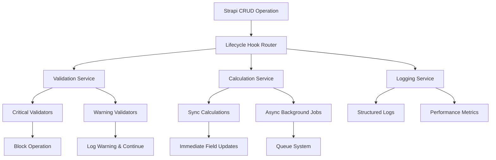
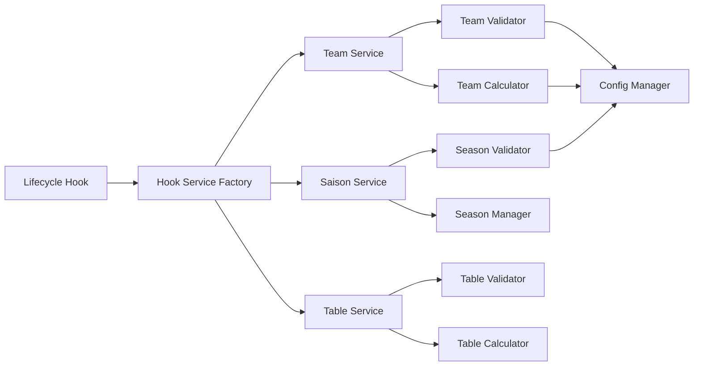

# Lifecycle Hooks Architecture Documentation

## Overview

This document describes the refactored Strapi Lifecycle Hooks architecture that transforms the original monolithic, error-prone system into a modular, stable, and performant solution. The new architecture follows the principle of "graceful degradation" and separates critical from non-critical operations.

## Architecture Principles

### 1. Graceful Degradation
- System continues to function even when non-critical components fail
- Critical operations are protected and isolated
- Fallback mechanisms ensure basic functionality remains available

### 2. Modular Design
- Each hook service has a single, well-defined responsibility
- Services are loosely coupled and independently testable
- Clear separation between validation, calculation, and monitoring concerns

### 3. Performance First
- Synchronous operations are limited to essential tasks only
- Heavy calculations are moved to background processing
- Timeout protection prevents blocking operations

## High-Level Architecture



## Core Components

### 1. Hook Service Factory

**Location**: `backend/src/services/HookServiceFactory.ts`

The central factory responsible for creating and managing all hook services with unified error handling.

```typescript
interface HookServiceFactory {
  createTeamService(): TeamHookService
  createSaisonService(): SaisonHookService
  createTableService(): TableHookService
  getConfig(): HookConfiguration
}
```

**Key Features**:
- Dependency injection for configuration
- Service lifecycle management
- Unified error handling across all services

### 2. Base Hook Service

**Location**: `backend/src/services/BaseHookService.ts`

Abstract base class providing common functionality for all hook services.

```typescript
abstract class BaseHookService {
  protected config: HookConfiguration
  protected logger: Logger
  
  abstract beforeCreate(event: HookEvent): Promise<HookResult>
  abstract beforeUpdate(event: HookEvent): Promise<HookResult>
  abstract afterCreate(event: HookEvent): Promise<void>
  abstract afterUpdate(event: HookEvent): Promise<void>
  
  protected async executeWithTimeout<T>(
    operation: () => Promise<T>,
    timeoutMs: number
  ): Promise<T>
  
  protected handleError(error: Error, context: HookContext): HookResult
}
```

**Key Features**:
- Timeout protection for all operations
- Standardized error handling
- Performance monitoring integration
- Configuration management

### 3. Validation Service

**Location**: `backend/src/services/ValidationService.ts`

Modular validation system with configurable rule management.

```typescript
interface ValidationService {
  validateCritical(data: any, rules: ValidationRule[]): ValidationResult
  validateWarning(data: any, rules: ValidationRule[]): ValidationResult
  isValidationEnabled(ruleName: string): boolean
}
```

**Key Features**:
- Separation of critical vs warning validations
- Configurable validation rules
- Rule dependency resolution
- Localized error messages

### 4. Calculation Service

**Location**: `backend/src/services/CalculationService.ts`

Handles automatic field calculations with sync/async separation.

```typescript
interface CalculationService {
  calculateSync(data: any, calculations: SyncCalculation[]): CalculationResult
  scheduleAsync(data: any, calculations: AsyncCalculation[]): void
  getCalculationStatus(jobId: string): CalculationStatus
}
```

**Key Features**:
- Immediate synchronous calculations for critical fields
- Background processing for complex calculations
- Calculation dependency management
- Fallback values for failed calculations

## Service Layer Architecture



### Content-Type Specific Services

#### TeamHookService
**Location**: `backend/src/services/TeamHookService.ts`

Handles team-related lifecycle operations including:
- Team name uniqueness validation
- Team-liga-saison consistency checks
- Team statistics calculations
- Team relationship validation

#### SaisonHookService
**Location**: `backend/src/services/SaisonHookService.ts`

Manages season lifecycle operations including:
- Season overlap validation
- Single active season constraint
- Season activation management
- Season transition handling

#### TableHookService
**Location**: `backend/src/services/TableHookService.ts`

Handles table entry operations including:
- Table position calculations
- Points and goal difference calculations
- Table data consistency validation
- League statistics aggregation

## Background Processing System


### Job Management Service
**Location**: `backend/src/services/JobManagementService.ts`

Provides background job infrastructure with:
- Priority-based job queuing
- Job persistence and recovery
- Worker management
- Status tracking and monitoring

### Background Job Types

1. **Table Calculation Jobs** (`backend/src/services/jobs/TableCalculationJobs.ts`)
   - League-wide table position updates
   - Statistics aggregation
   - Ranking calculations

2. **Team Statistics Jobs** (`backend/src/services/jobs/TeamStatisticsJobs.ts`)
   - Team performance calculations
   - Form calculations
   - Ranking updates

3. **Season Calculation Jobs** (`backend/src/services/jobs/SeasonCalculationJobs.ts`)
   - Season-wide statistics
   - Summary generation
   - Transition processing

## Configuration System

### Configuration Schema
**Location**: `backend/src/services/config/HookConfigurationSchema.ts`

Defines the structure for hook configuration:

```typescript
interface HookConfig {
  contentType: string
  hooks: {
    beforeCreate?: HookDefinition
    beforeUpdate?: HookDefinition
    afterCreate?: HookDefinition
    afterUpdate?: HookDefinition
  }
  validations: ValidationRule[]
  calculations: CalculationDefinition[]
}
```

### Configuration Management
**Location**: `backend/src/services/config/ConfigurationLoader.ts`

Features:
- Environment-specific configuration loading
- Configuration validation and versioning
- Runtime configuration updates
- Configuration inheritance system

## Feature Flag System

### Feature Flag Service
**Location**: `backend/src/services/feature-flags/FeatureFlagService.ts`

Provides:
- Feature flag storage and retrieval
- Flag evaluation logic
- Caching system
- Usage analytics

### Feature Flag Management
**Location**: `backend/src/services/feature-flags/FeatureFlagManagement.ts`

Includes:
- Administration interface
- Rollout controls
- Performance monitoring
- Usage tracking

## Monitoring and Observability

### Structured Logging
**Location**: `backend/src/services/logging/StructuredLogger.ts`

Features:
- Consistent log format across all hooks
- Contextual logging with request tracing
- Log aggregation and indexing
- Performance metrics collection

### Performance Monitoring
**Location**: `backend/src/services/logging/PerformanceMonitor.ts`

Provides:
- Hook execution time tracking
- Performance metrics collection
- Alerting system
- Trend analysis

### Error Tracking
**Location**: `backend/src/services/logging/ErrorTracker.ts`

Includes:
- Comprehensive error logging
- Error categorization and analysis
- Alerting and notification
- Recovery tracking

### Monitoring Dashboard
**Location**: `backend/src/services/monitoring/HookMonitoringDashboard.ts`

Real-time dashboard featuring:
- Hook execution status
- Performance metrics visualization
- Error rate monitoring
- Feature flag status

## Data Flow Patterns

### Hook Execution Flow

1. **Request Received**: Strapi receives CRUD operation
2. **Hook Triggered**: Appropriate lifecycle hook is called
3. **Service Factory**: Creates or retrieves service instance
4. **Validation**: Critical and warning validations are executed
5. **Sync Calculations**: Immediate calculations are performed
6. **Async Scheduling**: Heavy calculations are queued for background processing
7. **Response**: Operation completes with appropriate result
8. **Background Processing**: Queued jobs are processed asynchronously

### Error Handling Flow

1. **Error Occurs**: Exception is thrown in hook operation
2. **Error Classification**: Error is categorized (critical/warning/info)
3. **Recovery Strategy**: Appropriate recovery mechanism is applied
4. **Fallback Execution**: Fallback values or operations are used
5. **Logging**: Error is logged with full context
6. **Monitoring**: Error metrics are updated
7. **Alerting**: Notifications are sent if thresholds are exceeded

## Integration Points

### Strapi Integration
- Lifecycle hooks are registered in content-type directories
- Services are integrated through Strapi's dependency injection
- Configuration is loaded from Strapi's config system

### Database Integration
- Connection pooling for efficient database access
- Transaction management for data consistency
- Query optimization and caching

### External Systems
- Monitoring systems integration
- Alerting service integration
- Log aggregation system integration

## Performance Characteristics

### Execution Time Targets
- Synchronous operations: < 100ms
- Background job scheduling: < 10ms
- Configuration loading: < 50ms
- Validation execution: < 30ms

### Scalability Features
- Horizontal scaling through job queue distribution
- Caching layers for configuration and validation rules
- Connection pooling for database efficiency
- Async processing for heavy operations

## Security Considerations

### Input Validation
- All inputs are sanitized before processing
- Strict type checking throughout the system
- SQL/NoSQL injection prevention

### Access Control
- Hook permissions are enforced
- Sensitive data access is controlled
- All critical operations are audited

### Data Protection
- Sensitive configuration is encrypted
- Audit logs are tamper-proof
- Access patterns are monitored

## Testing Strategy

### Unit Testing
- Each service is independently testable
- Mock dependencies for isolation
- Comprehensive test coverage for all components

### Integration Testing
- End-to-end hook workflow testing
- Database integration validation
- Service interaction verification

### Performance Testing
- Load testing for concurrent operations
- Stress testing for background job processing
- Memory and resource usage validation

## Deployment Architecture

### Development Environment
- Local Strapi instance with file-based configuration
- In-memory job queue for testing
- Console-based monitoring

### Staging Environment
- Database-backed configuration
- Redis-based job queue
- Basic monitoring dashboard

### Production Environment
- Distributed job processing
- Full monitoring and alerting
- High availability configuration

This architecture provides a robust, scalable, and maintainable foundation for Strapi lifecycle hooks that can handle the demands of a production football club management system.