# Service Interaction Diagrams

## Overview

This document provides detailed diagrams and explanations of how services interact within the refactored lifecycle hooks system.

## Service Interaction Patterns

### 1. Hook Execution Flow

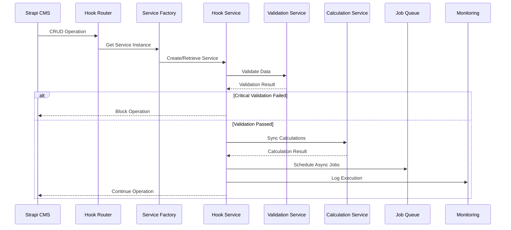

### 2. Validation Service Interaction

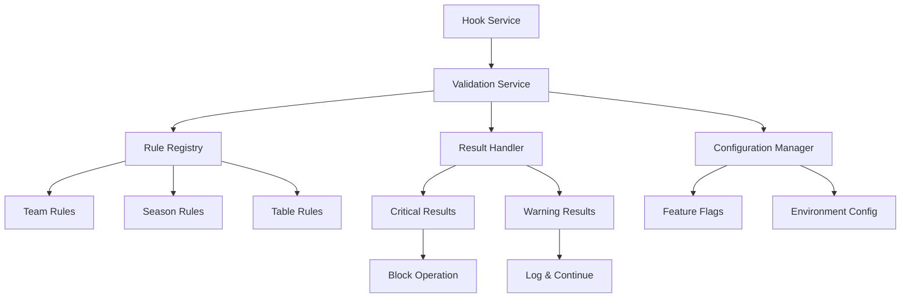

### 3. Calculation Service Flow

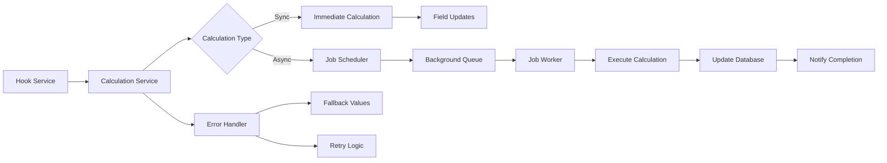

### 4. Configuration System Interaction

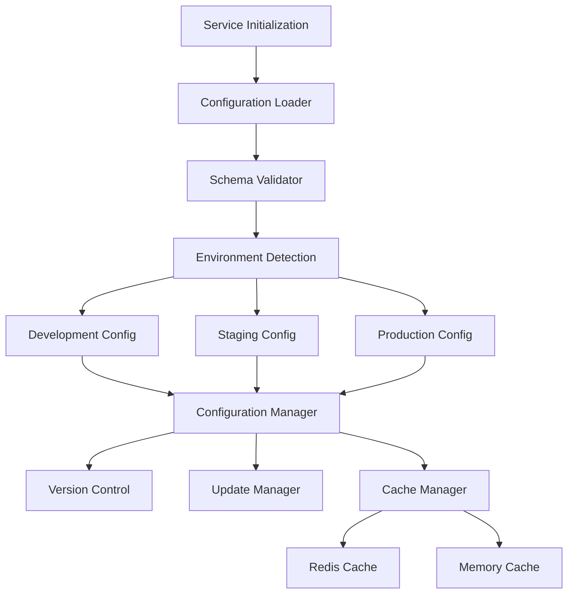

### 5. Background Job Processing

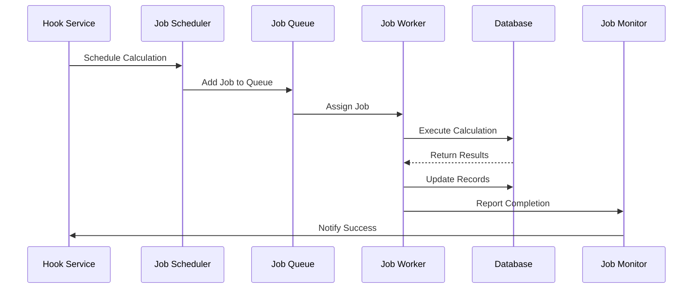

## Service Dependencies

### Core Service Dependencies

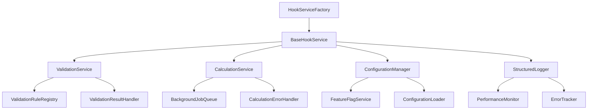

### Content-Type Service Dependencies

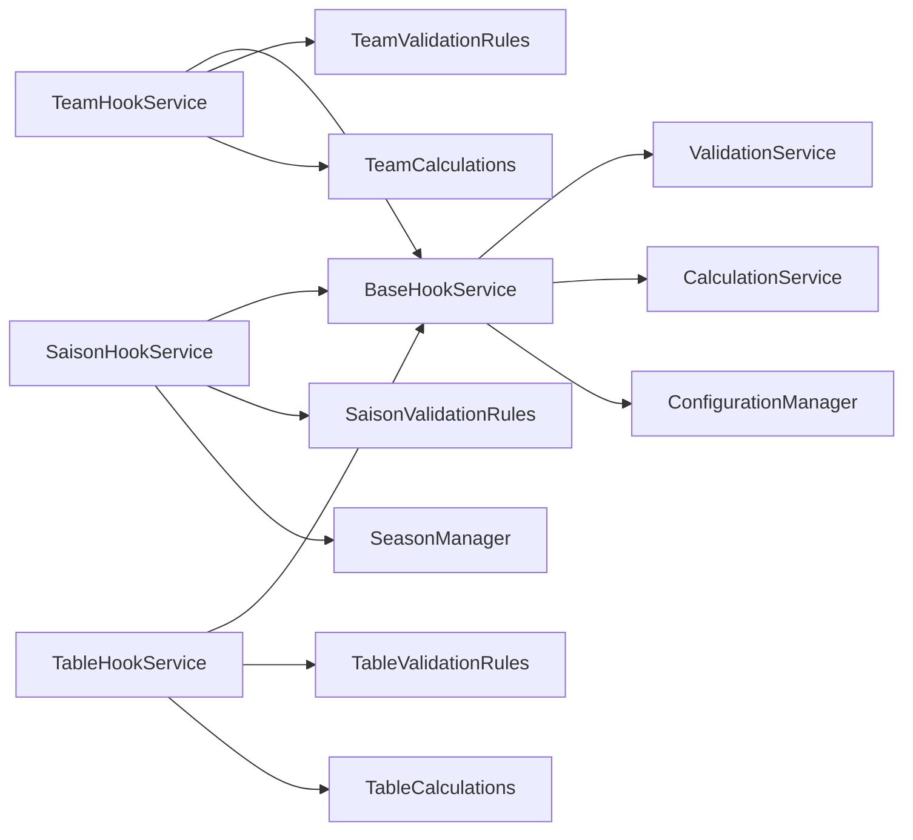

## Data Flow Patterns

### 1. Team Creation Flow

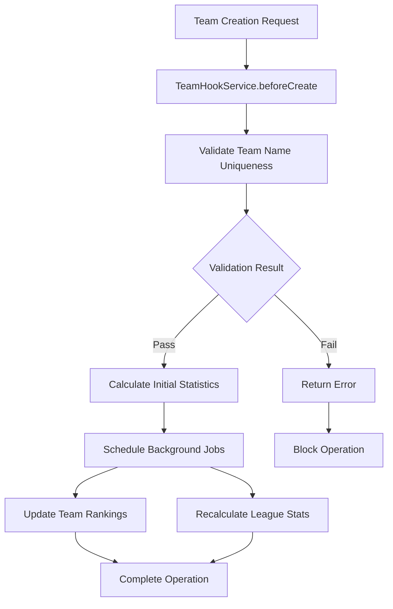

### 2. Season Overlap Validation Flow

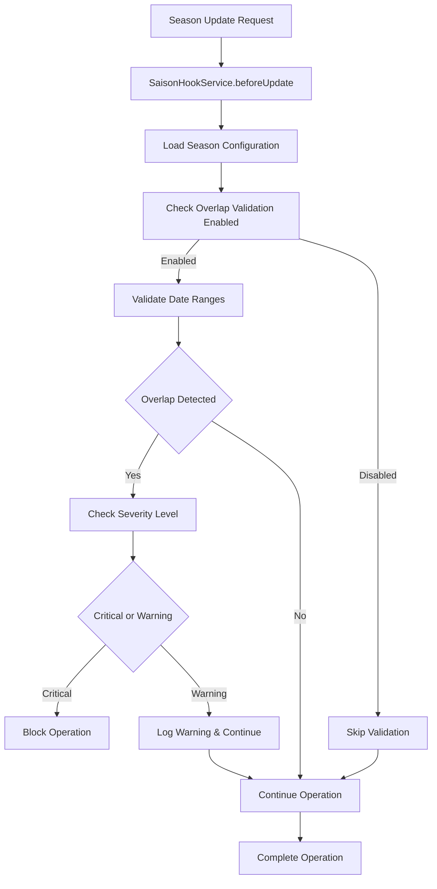

### 3. Table Calculation Flow

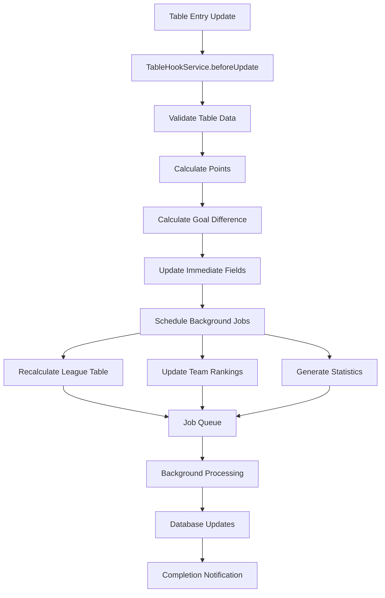

## Error Handling Patterns

### 1. Error Classification and Recovery

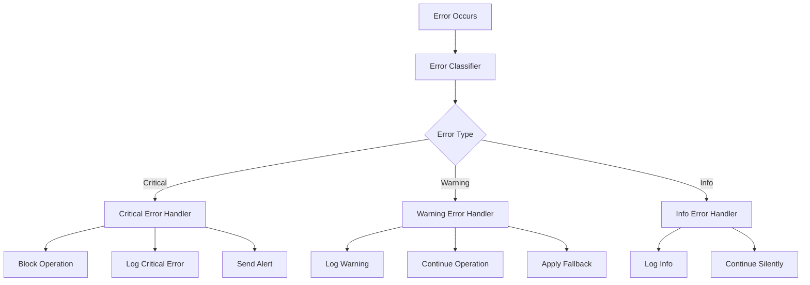

### 2. Timeout and Retry Pattern

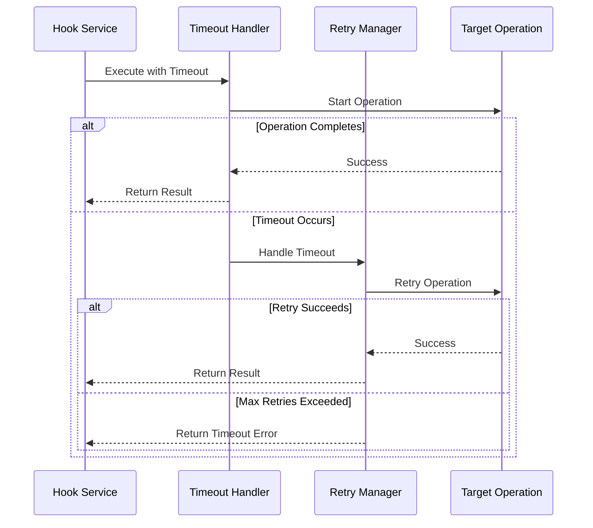

## Monitoring Integration Patterns

### 1. Performance Monitoring Flow

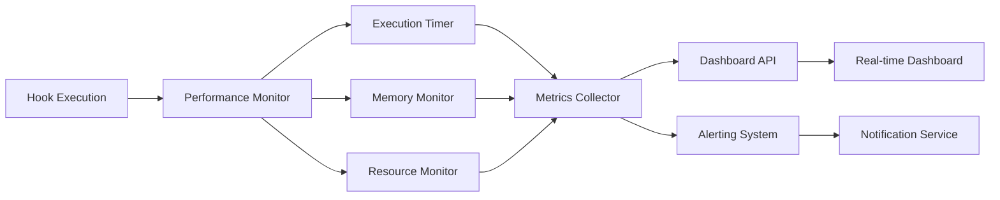

### 2. Error Tracking Integration

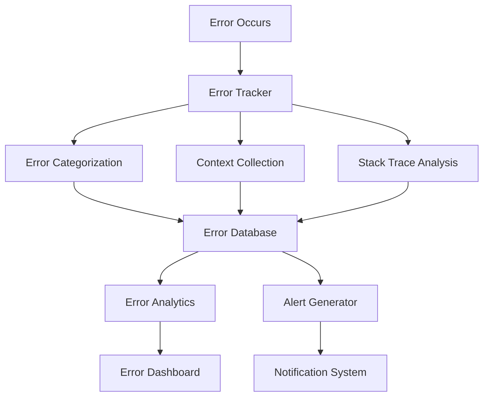

## Configuration Management Patterns

### 1. Configuration Loading and Caching

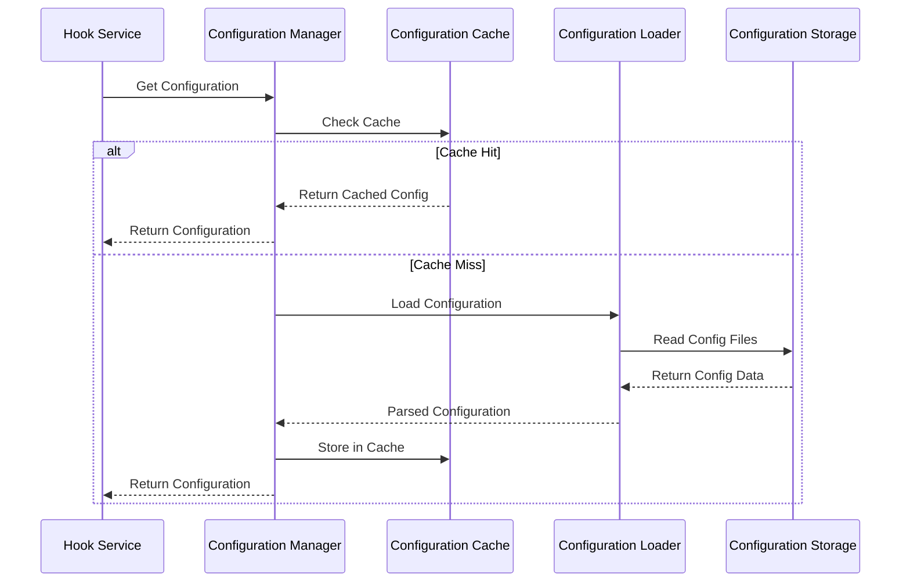

### 2. Feature Flag Evaluation

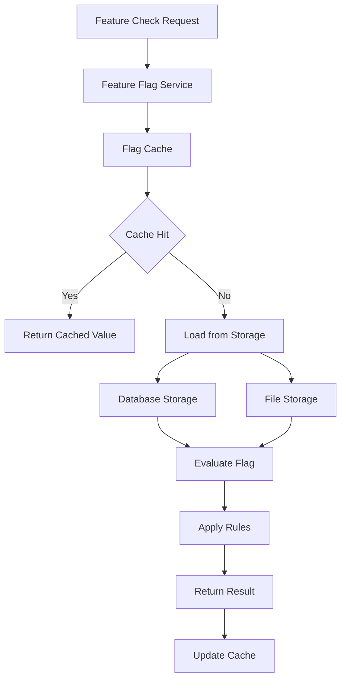

## Integration Patterns

### 1. Strapi Integration

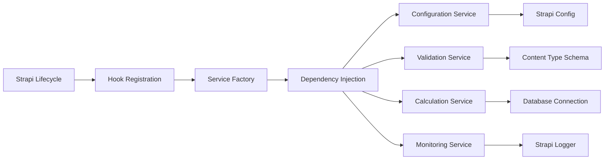

### 2. Database Integration

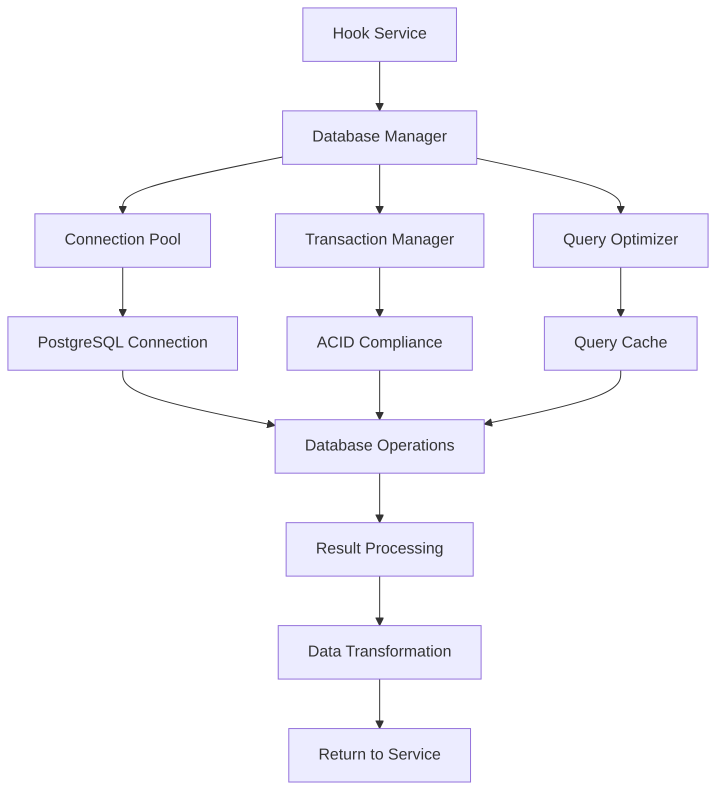

These interaction patterns ensure that the refactored lifecycle hooks system maintains clear separation of concerns, provides robust error handling, and enables efficient monitoring and maintenance of the system.