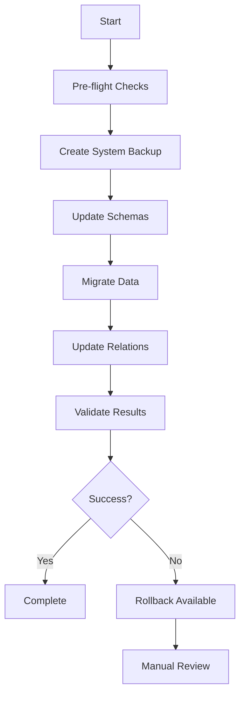

# Team/Mannschaft Consolidation Documentation

## Overview

This document describes the consolidation process for merging the duplicate `team` and `mannschaft` concepts in the Strapi backend. The consolidation eliminates data duplication and ensures a single source of truth for team data.

## Problem Statement

The backend currently has two overlapping content types:
- `team` - Contains team information with relations to `spieler` and `spiel`
- `mannschaft` - Contains similar team information with overlapping fields

This duplication causes:
- Data inconsistency between the two concepts
- Confusion in API responses
- Broken bidirectional relations
- Maintenance overhead

## Solution

The consolidation strategy:
1. **Consolidate to `mannschaft`** as the single source of truth
2. **Migrate all `team` data** to `mannschaft` records
3. **Update all references** to use `mannschaft` instead of `team`
4. **Remove `team` concept** after successful migration

## Scripts Overview

### Core Scripts

| Script | Purpose | Usage |
|--------|---------|-------|
| `run-team-mannschaft-consolidation.js` | Master orchestration script | `node run-team-mannschaft-consolidation.js` |
| `update-schemas-for-consolidation.js` | Updates content type schemas | Called by master script |
| `consolidate-team-mannschaft.js` | Migrates data from team to mannschaft | Called by master script |
| `validate-consolidation.js` | Validates consolidation success | Called by master script |
| `rollback-consolidation.js` | Rolls back changes if needed | `node rollback-consolidation.js` |

### Schema Changes

#### Spiel Schema
- **Removed**: `unser_team` relation
- **Enhanced**: `unsere_mannschaft` (made required)
- **Added**: `gegner_mannschaft` for opponent teams

#### Spieler Schema
- **Removed**: `hauptteam` and `aushilfe_teams` relations
- **Enhanced**: `mannschaft` (made required)
- **Added**: `aushilfe_mannschaften` for substitute assignments

#### Mannschaft Schema
- **Enhanced**: All fields from team schema
- **Added**: Missing relations (club, liga, saison)
- **Standardized**: Field types and constraints

## Usage Instructions

### Running the Consolidation

```bash
# Navigate to backend directory
cd backend

# Run the complete consolidation process
node scripts/run-team-mannschaft-consolidation.js

# Or run specific phases
node scripts/run-team-mannschaft-consolidation.js run
node scripts/run-team-mannschaft-consolidation.js validate
```

### Rollback if Needed

```bash
# Rollback all changes
node scripts/run-team-mannschaft-consolidation.js rollback

# Or run rollback script directly
node scripts/rollback-consolidation.js
```

### Validation Only

```bash
# Run validation without making changes
node scripts/run-team-mannschaft-consolidation.js validate
```

## Process Flow



## Data Migration Strategy

### Conflict Resolution

When both `team` and `mannschaft` records exist with the same name:
1. **Merge data** prioritizing `team` data for most fields
2. **Preserve unique data** from both records
3. **Update all references** to point to the merged record
4. **Log conflicts** for manual review

### Field Mapping

| Team Field | Mannschaft Field | Notes |
|------------|------------------|-------|
| `name` | `name` | Direct mapping |
| `liga_name` | `liga` | String field |
| `liga_vollname` | `liga_vollname` | Direct mapping |
| `trainer` | `trainer` | Direct mapping |
| `co_trainer` | `co_trainer` | Direct mapping |
| `tabellenplatz` | `tabellenplatz` | Direct mapping |
| All stats fields | Same | Direct mapping |

### Relation Updates

| Old Relation | New Relation | Content Type |
|--------------|--------------|--------------|
| `spiel.unser_team` | `spiel.unsere_mannschaft` | spiel |
| `spieler.hauptteam` | `spieler.mannschaft` | spieler |
| `spieler.aushilfe_teams` | `spieler.aushilfe_mannschaften` | spieler |

## Backup and Safety

### Automatic Backups

The consolidation process creates multiple backup levels:
1. **Schema backups** - Original schema files
2. **Data backups** - Complete data snapshots
3. **Relation backups** - Relation state before changes

### Backup Locations

```
backend/backups/
├── system-backup/           # Complete system backup
├── schema-updates/          # Schema file backups
├── team-mannschaft-consolidation/  # Data backups
└── validation-reports/      # Validation results
```

### Rollback Capabilities

- **Schema rollback** - Restore original schema files
- **Data rollback** - Restore original data state
- **Partial rollback** - Rollback specific components
- **Validation** - Verify rollback success

## Validation Checks

### Schema Validation
- ✅ `spiel` no longer references `unser_team`
- ✅ `spiel.unsere_mannschaft` is required
- ✅ `spieler` no longer references `hauptteam`
- ✅ `spieler.mannschaft` is required
- ✅ `mannschaft` has all required fields

### Data Validation
- ✅ No duplicate mannschaft names
- ✅ All data migrated successfully
- ✅ No orphaned records
- ✅ Data completeness maintained

### Relation Validation
- ✅ All spiele reference mannschaft
- ✅ All spieler reference mannschaft
- ✅ Bidirectional relations consistent
- ✅ No broken relation references

### API Validation
- ✅ All endpoints return correct data
- ✅ Relations populate properly
- ✅ CRUD operations work correctly

## Post-Consolidation Steps

### 1. Update Service Layer
After successful consolidation:
- Update service methods to use mannschaft
- Remove team-related service code
- Update API endpoint logic

### 2. Update Frontend
- Update frontend components to use mannschaft
- Remove team-related frontend code
- Update API calls and data structures

### 3. Remove Team Content Type
Once everything is validated:
- Remove team content type definition
- Clean up team-related files
- Update documentation

## Troubleshooting

### Common Issues

#### Schema Update Failures
```bash
# Check schema file permissions
ls -la backend/src/api/*/content-types/*/schema.json

# Manually restore schema if needed
cp backend/backups/schema-updates/spiel-schema-backup-*.json backend/src/api/spiel/content-types/spiel/schema.json
```

#### Data Migration Errors
```bash
# Check migration logs
cat backend/backups/team-mannschaft-consolidation/consolidation.log

# Run validation to identify issues
node scripts/validate-consolidation.js
```

#### Relation Inconsistencies
```bash
# Run relation repair (if available)
node scripts/repair-relations.js

# Or rollback and retry
node scripts/rollback-consolidation.js
```

### Recovery Procedures

#### Complete Rollback
```bash
# Full system rollback
node scripts/rollback-consolidation.js

# Restart Strapi
npm run develop
```

#### Partial Recovery
```bash
# Schema-only rollback
node scripts/rollback-consolidation.js --schemas-only

# Data-only rollback
node scripts/rollback-consolidation.js --data-only
```

## Success Criteria

The consolidation is considered successful when:
- ✅ All validation checks pass
- ✅ No duplicate team concepts exist
- ✅ All relations work correctly
- ✅ API endpoints return consistent data
- ✅ No data loss occurred
- ✅ System performance maintained

## Monitoring

### Post-Consolidation Monitoring
- Monitor API response times
- Check for relation errors in logs
- Validate data consistency regularly
- Monitor frontend functionality

### Regular Validation
```bash
# Run periodic validation
node scripts/validate-consolidation.js

# Check for new inconsistencies
node scripts/comprehensive-data-analysis.js
```

## Support

For issues or questions:
1. Check the troubleshooting section
2. Review backup and log files
3. Run validation scripts for diagnostics
4. Consider rollback if critical issues arise

## Version History

| Version | Date | Changes |
|---------|------|---------|
| 1.0 | 2025-01-23 | Initial consolidation implementation |

---

**⚠️ Important**: Always run in a development environment first and ensure you have complete backups before running in production.