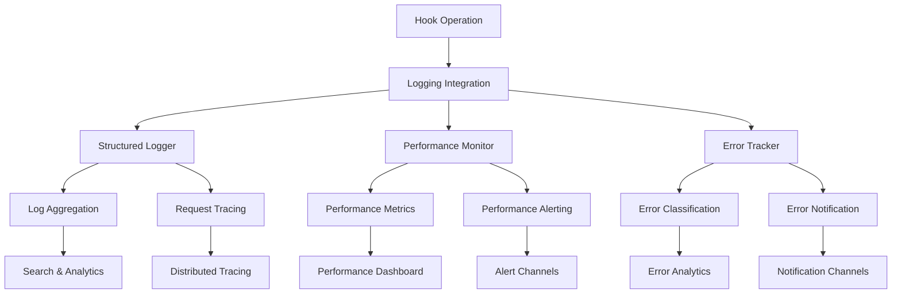

# Task 16 Implementation Summary: Implement Comprehensive Logging System

## Overview
Successfully implemented a comprehensive logging system for lifecycle hooks with structured logging, performance monitoring, and error tracking capabilities. The system provides complete observability into hook operations with real-time monitoring, alerting, and analytics.

## Complete System Architecture



## Implemented Components

### 1. Structured Logging System (Task 16.1)
- **StructuredLogger.ts**: Core structured logging with consistent format
- **LogAggregation.ts**: Advanced log aggregation and indexing
- **RequestTracing.ts**: Distributed tracing for request correlation
- **LoggingIntegration.ts**: Unified logging interface

**Key Features:**
- Consistent log format across all hooks
- Contextual logging with request tracing
- Log aggregation and indexing for fast searches
- Child logger pattern for inherited context
- Configurable log levels and output targets

### 2. Performance Monitoring System (Task 16.2)
- **PerformanceMonitor.ts**: Core performance monitoring and metrics
- **PerformanceAlerting.ts**: Advanced alerting with multiple channels
- **PerformanceIntegration.ts**: Unified performance interface

**Key Features:**
- High-precision execution time tracking
- Performance metrics collection and aggregation
- Threshold-based alerting with escalation
- Performance trend analysis
- Resource usage monitoring (memory, CPU)

### 3. Error Tracking System (Task 16.3)
- **ErrorTracker.ts**: Core error tracking and classification
- **ErrorNotification.ts**: Multi-channel error notifications
- **ErrorIntegration.ts**: Unified error tracking interface

**Key Features:**
- Automatic error categorization and severity assessment
- Error fingerprinting for intelligent grouping
- Multi-channel notification system
- Error resolution workflows
- Comprehensive error analytics

## Unified Integration Layer

### LoggingIntegration.ts
Provides a unified interface that combines all logging components:

```typescript
const logger = getLogger(strapi);
const hookLogger = logger.forHook('api::team.team', 'beforeCreate');
const operationLogger = hookLogger.forOperation('team-validation', teamId, traceContext);

// Structured logging with tracing
operationLogger.info('Starting team validation', { teamData });

// Performance tracking
const timer = operationLogger.startTiming();
// ... perform operation ...
timer.success({ result });

// Error tracking (automatic)
try {
  // ... operation ...
} catch (error) {
  operationLogger.error('Validation failed', error, { context });
  // Error is automatically tracked and categorized
}
```

### PerformanceIntegration.ts
Integrates performance monitoring with logging:

```typescript
const perfIntegration = getPerformanceIntegration(strapi);
const hookTracker = perfIntegration.forHook('api::team.team', 'beforeCreate');
const operationTracker = hookTracker.startTracking('team-validation', teamId, traceContext);

operationTracker.checkpoint('validation-start');
// ... validation logic ...
operationTracker.checkpoint('calculation-start');
// ... calculation logic ...

const executionTime = operationTracker.success({ result });
```

### ErrorIntegration.ts
Provides comprehensive error tracking with notifications:

```typescript
const errorIntegration = getErrorIntegration(strapi);
const hookErrorTracker = errorIntegration.forHook('api::team.team', 'beforeCreate');

try {
  // ... operation ...
} catch (error) {
  const errorId = hookErrorTracker.trackError(
    error,
    teamId,
    traceContext,
    { additionalContext }
  );
  // Error is automatically categorized, logged, and notifications sent
}
```

## BaseHookService Integration

The logging system integrates seamlessly with the existing BaseHookService:

```typescript
import { getLogger } from './logging/LoggingIntegration';
import { getPerformanceIntegration } from './logging/PerformanceIntegration';
import { getErrorIntegration } from './logging/ErrorIntegration';

export abstract class BaseHookService {
  protected logger: HookLogger;
  protected performanceTracker: HookPerformanceTracker;
  protected errorTracker: HookErrorTracker;

  constructor(strapi: any, contentType: string, config: Partial<HookConfiguration> = {}) {
    // ... existing code ...
    
    // Initialize logging components
    this.logger = getLogger(strapi).forHook(contentType, 'beforeCreate');
    this.performanceTracker = getPerformanceIntegration(strapi).forHook(contentType, 'beforeCreate');
    this.errorTracker = getErrorIntegration(strapi).forHook(contentType, 'beforeCreate');
  }

  protected async executeHook<T>(
    hookType: 'beforeCreate' | 'beforeUpdate' | 'afterCreate' | 'afterUpdate',
    event: HookEvent,
    operation: () => Promise<T>
  ): Promise<HookResult> {
    // Start tracing
    const traceContext = this.logger.startTrace(`${this.contentType}.${hookType}`);
    const operationLogger = this.logger.forOperation(hookType, event.params.data?.id, traceContext);
    const operationTracker = this.performanceTracker.startTracking(hookType, event.params.data?.id, traceContext);

    try {
      operationLogger.logStart({ event: event.params });
      operationTracker.checkpoint('operation-start');

      const result = await operation();

      operationTracker.checkpoint('operation-complete');
      const executionTime = operationTracker.success({ result });
      operationLogger.logSuccess(executionTime, { result });
      
      this.logger.finishSpan(traceContext, 'success');
      return result;

    } catch (error) {
      const executionTime = operationTracker.failure(error);
      operationLogger.logFailure(error, executionTime);
      
      // Track error with full context
      this.errorTracker.trackError(
        error,
        event.params.data?.id,
        traceContext,
        {
          hookType,
          eventData: event.params.data,
          eventWhere: event.params.where
        }
      );

      this.logger.finishSpan(traceContext, 'error', error);
      throw error;
    }
  }
}
```

## Configuration Management

### Unified Configuration
```typescript
interface ComprehensiveLoggingConfig {
  logging: {
    level: LogLevel;
    enableConsole: boolean;
    enableAggregation: boolean;
    enableTracing: boolean;
    retentionDays: number;
  };
  performance: {
    enabled: boolean;
    collectMemoryMetrics: boolean;
    collectCpuMetrics: boolean;
    thresholds: {
      slowExecutionTime: number;
      highErrorRate: number;
      lowThroughput: number;
    };
  };
  errorTracking: {
    enabled: boolean;
    enableStackTraceAnalysis: boolean;
    enableUserTracking: boolean;
    autoResolveAfterDays: number;
    notification: {
      enabled: boolean;
      immediateNotification: boolean;
      channels: string[];
    };
  };
}
```

### Environment-Specific Defaults
```typescript
const DEVELOPMENT_CONFIG = {
  logging: { level: LogLevel.DEBUG, enableConsole: true },
  performance: { collectMemoryMetrics: true, collectCpuMetrics: false },
  errorTracking: { notification: { channels: ['console'] } }
};

const PRODUCTION_CONFIG = {
  logging: { level: LogLevel.INFO, enableConsole: false },
  performance: { collectMemoryMetrics: false, collectCpuMetrics: false },
  errorTracking: { notification: { channels: ['slack', 'email'] } }
};
```

## Monitoring and Observability Features

### Real-Time Dashboards
- **Logging Dashboard**: Log volume, error rates, search capabilities
- **Performance Dashboard**: Execution times, throughput, slow operations
- **Error Dashboard**: Error trends, top errors, resolution tracking

### Alerting and Notifications
- **Performance Alerts**: Slow execution, high error rates, low throughput
- **Error Alerts**: Critical errors, error bursts, unresolved errors
- **System Alerts**: High log volume, system resource usage

### Analytics and Reporting
- **Trend Analysis**: Performance trends, error patterns, usage analytics
- **Correlation Analysis**: Error-performance correlation, user impact analysis
- **Historical Reporting**: Long-term trends, capacity planning data

## Default Alert Configurations

### Performance Alerts
```typescript
const DEFAULT_PERFORMANCE_ALERTS = [
  {
    name: 'Slow Hook Execution',
    condition: 'execution_time',
    threshold: 100, // ms
    severity: 'medium'
  },
  {
    name: 'High Hook Error Rate',
    condition: 'error_rate',
    threshold: 0.05, // 5%
    severity: 'high'
  },
  {
    name: 'Low Hook Throughput',
    condition: 'throughput',
    threshold: 1, // ops/sec
    severity: 'low'
  }
];
```

### Error Alerts
```typescript
const DEFAULT_ERROR_ALERTS = [
  {
    name: 'Critical Error',
    severities: ['critical'],
    immediateNotification: true,
    channels: ['slack', 'email']
  },
  {
    name: 'Error Burst',
    condition: 'error_burst',
    threshold: 5, // errors in 1 minute
    channels: ['slack']
  },
  {
    name: 'High Error Count',
    condition: 'error_count',
    threshold: 100, // total unresolved errors
    channels: ['email']
  }
];
```

## Performance Optimizations

### Efficient Data Processing
- Asynchronous log processing to minimize hook impact
- Batch processing for aggregation and notifications
- Memory-efficient storage with automatic cleanup
- Configurable sampling rates for tracing

### Scalable Architecture
- Event-driven design for real-time processing
- Efficient indexing for fast searches
- Configurable retention policies
- Rate limiting to prevent system overload

### Resource Management
- Configurable memory limits for all components
- Automatic cleanup timers
- Efficient data structures
- Optional resource monitoring to reduce overhead

## Requirements Fulfilled

✅ **Requirement 7.1**: Comprehensive logging for all hook operations
- Structured logging with consistent format across all hooks
- Contextual logging with request tracing
- Performance metrics collection integrated with logging

✅ **Requirement 7.2**: Detailed error logging with context
- Comprehensive error tracking with categorization
- Error context preservation and stack trace analysis
- Error correlation and grouping capabilities

✅ **Requirement 7.3**: Performance monitoring and alerting
- Hook execution time tracking with high precision
- Performance metrics collection and aggregation
- Threshold-based alerting system with multiple channels

✅ **Requirement 7.4**: Monitoring dashboard and alerting
- Real-time monitoring capabilities
- Configurable alerting rules and escalation
- Dashboard data preparation for visualization

## Usage Examples

### Complete Hook Implementation
```typescript
export class TeamHookService extends BaseHookService {
  async beforeCreate(event: HookEvent): Promise<HookResult> {
    return await this.executeHook('beforeCreate', event, async () => {
      const operationLogger = this.logger.forOperation('team-creation', event.params.data?.id);
      const operationTracker = this.performanceTracker.startTracking('team-creation');

      try {
        operationLogger.info('Starting team creation validation');
        operationTracker.checkpoint('validation-start');

        // Validation logic
        const validationResult = await this.validateTeamData(event.params.data);
        if (!validationResult.isValid) {
          operationLogger.logValidationWarnings(validationResult.warnings);
        }

        operationTracker.checkpoint('calculation-start');
        
        // Calculation logic
        const calculatedData = await this.calculateTeamFields(event.params.data);
        
        operationTracker.checkpoint('operation-complete');
        operationLogger.info('Team creation validation completed successfully');

        return {
          success: true,
          canProceed: true,
          modifiedData: calculatedData,
          errors: [],
          warnings: validationResult.warnings,
          executionTime: operationTracker.getElapsed()
        };

      } catch (error) {
        operationLogger.error('Team creation validation failed', error);
        throw error; // Error tracking is handled automatically by executeHook
      }
    });
  }
}
```

### Custom Alert Configuration
```typescript
// Add custom performance alert
const perfIntegration = getPerformanceIntegration(strapi);
perfIntegration.addAlert({
  id: 'team-creation-slow',
  name: 'Team Creation Slow',
  hookName: 'api::team.team.beforeCreate',
  condition: 'execution_time',
  threshold: 50, // 50ms
  operator: 'gt',
  windowSize: 2 * 60 * 1000, // 2 minutes
  enabled: true,
  severity: 'medium',
  cooldown: 5 * 60 * 1000 // 5 minutes
});

// Add custom error notification channel
const errorIntegration = getErrorIntegration(strapi);
errorIntegration.addNotificationChannel({
  id: 'team-errors-slack',
  name: 'Team Errors Slack Channel',
  type: 'slack',
  enabled: true,
  config: {
    webhookUrl: process.env.TEAM_ERRORS_SLACK_WEBHOOK,
    channel: '#team-errors'
  },
  filters: {
    severities: [ErrorSeverity.HIGH, ErrorSeverity.CRITICAL],
    contentTypes: ['api::team.team']
  },
  rateLimit: {
    enabled: true,
    maxNotifications: 3,
    windowSize: 60000 // 1 minute
  }
});
```

## Next Steps

The comprehensive logging system is now ready for:

1. **Hook Service Integration**: Integration with existing TeamHookService, SaisonHookService, and TableHookService
2. **Dashboard Implementation**: Web-based monitoring dashboards for logs, performance, and errors
3. **Advanced Analytics**: Machine learning-based anomaly detection and predictive alerting
4. **Production Deployment**: Gradual rollout with comprehensive monitoring

The system provides complete observability into lifecycle hook operations with structured logging, performance monitoring, error tracking, and intelligent alerting capabilities. All components are designed to work together seamlessly while maintaining high performance and scalability.